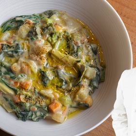

# Etruscan Soup
> **tags**: #Soup #0star

## Description

## Ingredients

### Legumes
- Chickpeas: 100g (preferably from Murgia in Puglia)
- Cannellini Beans: 100g (from Tuscany)
- Sorana Beans: 100g

### Aromatics
- 1 whole garlic clove per legume batch
- 2 sage leaves per legume batch
- Extra virgin olive oil

### Vegetables
- Savoy cabbage: A large slice (~1/4 head for 4 servings)
- Black kale: Stems and leaves separated
- Chard: Stems and leaves separated
- Spinach: Leaves and stems separated
- Zucchini: 1 medium
- Flat green beans: 100g
- Celery: Leaves and stalks separated
- Leek: 1/2 stalk
- Potatoes: 1 medium
- Onion: 1 small

### Grains
- Farro: 4 handfuls (~100g)

### Seasonings
- Rosemary
- Sage
- Fennel seeds
- Fennel flower or pollen
- Salt and black pepper

### Broth
- Vegetable trimmings (potato peels, celery leaves, leek greens, etc.)
- Water

## Directions
Soak the Legumes:

Soak chickpeas, cannellini beans, and Sorana beans in 8x their weight in water for 24 hours in a cool, dry place.

Cook the Legumes:

Cannellini Beans: Cook in a steel pot over direct heat until soft (1 hour). Blend into a smooth cream with olive oil.

Chickpeas and Sorana Beans: Cook in earthenware pots with garlic, sage, and olive oil at 120–130°C in the oven for 1.5 hours.

Prepare Garlic-Infused Oil:

Crush rosemary, sage, pepper, and garlic into a paste using a mortar.

Mix with olive oil and let infuse overnight.

Prepare Vegetables:

Dice savoy cabbage, black kale, zucchini, leek, celery stalks, and potatoes into uniform squares.

Julienne the spinach, chard, and their stems.

Make Broth:

Simmer vegetable trimmings in water to create a flavorful broth.

Cook Farro:

Sauté farro in the infused oil. Deglaze with broth and cook risotto-style for 20–25 minutes.

Assemble the Soup:

In a casserole, heat garlic-infused oil with fennel seeds.

Sauté onion, celery, and leek for 5 minutes. Add carrots, potatoes, and cabbages. Cook for another 5 minutes.

Add green beans, flat beans, zucchini, and remaining greens. Deglaze with broth.

Combine Components:

Stir in the cooked farro, chickpeas, Sorana beans, and cannellini bean cream. Adjust seasoning with salt and pepper.

Finish:

Serve at ~55°C. Drizzle with olive oil and sprinkle with fennel flower.

https://www.youtube.com/watch?v=Tx3xoCThDbE

## Notes

## Data
**prep**  | **cook**  | **total**  | **serves** 