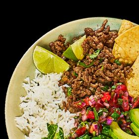

# [Fall-Apart Caramelized Cabbage](https://www.bonappetit.com/recipe/caramelized-cabbage)
> **tags**: # #0star

## Description

## Ingredients

- 1/4 cup double-concentrated tomato paste
- 3 garlic cloves, finely grated
- 11/2 tsp. ground coriander
- 11/2 tsp. ground cumin
- 1 tsp. crushed red pepper flakes
- 1 medium head of green or savoy cabbage (about 2 lb. total)
- 1/2 cup extra-virgin olive oil, divided
- Kosher salt
- 3 Tbsp. chopped dill, parsley, or cilantro
- Full-fat Greek yogurt or sour cream (for serving)

## Directions
Preheat oven to 350°. Mix tomato paste, garlic, coriander, cumin, and red pepper flakes in a small bowl.

Cut cabbage in half through core. Cut each half through core into 4 wedges.

Heat ¼ cup oil in a large cast-iron skillet over medium-high. Working in batches if needed, add cabbage to pan cut side down and season with salt. Cook, turning occasionally, until lightly charred, about 4 minutes per side. Transfer cabbage to a plate.

Pour remaining ¼ cup oil into skillet. Add spiced tomato paste and cook over medium heat, stirring frequently, until tomato paste begins to split and slightly darken, 2–3 minutes. Pour in enough water to come halfway up sides of pan (about 1½ cups), season with salt, and bring to a simmer. Nestle cabbage wedges back into skillet (they should have shrunk while browning; a bit of overlap is okay). Transfer cabbage to oven and bake, uncovered and turning wedges halfway through, until very tender, liquid is mostly evaporated, and cabbage is caramelized around the edges, 40–50 minutes.

Scatter dill over cabbage. Serve with yogurt alongside.

## Notes

## Data
**prep**  | **cook**  | **total**  | **serves** Yield 4 servings