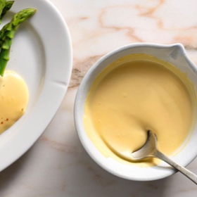

# [Foolproof Hollandaise](https://www.seriouseats.com/foolproof-2-minute-hollandaise-recipe)
> **tags**: # #0star

## Description

## Ingredients

- 2 large egg yolks
- 1 teaspoon (5ml) water
- 1 teaspoon (5ml) lemon juice from 1 lemon
- Kosher salt
- 1 stick unsalted butter (4 ounces; 113g)
- Pinch cayenne pepper or hot sauce, optional

## Directions
In a cup just wide enough to fit the head of an immersion blender, combine egg yolks, water, lemon juice, and a pinch of salt. In a small saucepan, melt butter over high heat, swirling constantly, until foaming subsides. Transfer butter to a 1 cup liquid measuring cup.

Place head of immersion blender into the bottom of the cup and turn it on. With the blender constantly running, slowly pour hot butter into measuring cup in a thin stream. It should emulsify with the egg yolk and lemon juice. If needed, tilt the blender head up slightly to help the emulsification process. Continue pouring until all butter is added. Sauce should be creamy and thick enough to coat a spoon but still flow off of it. If it is too thick, whisk in a small amount of warm water, 1 tablespoon (15ml) at a time, to thin it out to the desired consistency. Season to taste with salt and a pinch of cayenne pepper or hot sauce if desired. Serve immediately, or transfer to a small lidded pot and keep in a warm place for up to 1 hour before serving. Hollandaise cannot be cooled and reheated.

## Notes

## Data
**prep** 5 mins | **cook** 5 mins | **total**  | **serves** 2 to 4 servings