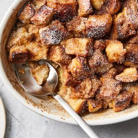

# [French Toast Casserole](https://cooking.nytimes.com/recipes/1024486-french-toast-casserole)
> **tags**: #Breakfast #Dessert #5star

## Description

## Ingredients

- 1 tablespoon unsalted butter
- 10 cups (1-inch) cubed bread, from a large loaf of day-old French bread (see Tip)
- 2 cups/480 milliliters whole milk
- 6 large eggs
- 1/4 cup/50 grams lightly packed light brown sugar
- 1 1/2 teaspoons vanilla extract
- 1 teaspoon ground cinnamon
- 1 teaspoon kosher salt (such as Diamond Crystal)
- 4 tablespoons/57 grams unsalted butter, melted
- 1/2 cup/100 grams lightly packed light brown sugar
- 1/2 teaspoon ground cinnamon
- Pinch of kosher salt (such as Diamond Crystal)
- Fresh berries, confectioners’ sugar, maple syrup and/or toasted chopped nuts, for serving (optional)

## Directions
Grease a 9-by-13-inch (or other 14-cup) baking dish with the butter, then place the bread cubes in the pan and spread them into an even layer.

In a medium bowl or large measuring cup, combine the milk, eggs, brown sugar, vanilla, cinnamon and salt. Whisk until smooth. Pour the custard mixture over the bread and press gently to help the bread absorb the liquid. Set aside, covered, for at least 30 minutes at room temperature, or up to 12 hours in the refrigerator.

Heat the oven to 400 degrees and let the casserole sit at room temperature while the oven heats. Meanwhile, make the topping: In a small bowl, mix the butter, brown sugar, cinnamon and salt with a fork until smooth. Dollop the mixture all over the casserole, then gently spread it with the back of a spoon until the entire surface is covered. (If preparing the casserole the day prior to baking, don’t add the topping until just before it goes into the oven. Reheat the topping, if needed.)

Bake, uncovered, until puffed and golden brown, 30 to 35 minutes. Cut into squares, and serve hot. Top as desired.

## Notes
To dry out bread cubes, spread them on a sheet pan and bake at 350 degrees until dry to the touch but not browned, 10 to 15 minutes.

To freeze: Assemble the casserole through Step 2 and refrigerate for at least 3 hours (or overnight). Tightly cover with plastic wrap, then foil, and freeze for up to 1 month. Thaw overnight in the refrigerator, then resume the recipe at Step 3.

## Data
**prep** 10 min | **cook** 1 hr 15 min | **total** 1 hr 25 min | **serves** 8 servings