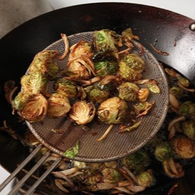

# [Fried Brussels Sprouts with Shallots, Honey, and Balsamic Vinegar](https://www.seriouseats.com/fried-brussels-sprouts-shallots-honey-balsamic-vinegar-recipe)
> **tags**: #To Try #0star

## Description

## Ingredients

- 3 tablespoons honey
- 1 tablespoon balsamic vinegar
- 1/4 cup minced fresh parsley leaves
- 2 quarts vegetable, canola, or peanut oil
- 3 pounds Brussels sprouts, stems trimmed, outer leaves removed, split in half
- 3 medium shallots, thinly sliced (about 1 cup)
- Kosher salt and freshly ground black pepper

## Directions
Combine honey, balsamic vinegar, and parsley in a small bowl and set aside.

Line a rimmed baking sheet with a triple layer of paper towels. In a 14-inch wok or 6-quart Dutch oven, heat oil to 400°F. Add half of Brussels sprouts and half of shallots. Oil temperature will drop to around 325°F. Adjust heat to maintain this temperature. Cook, stirring and agitating with a metal spider (a small metal strainer that has a long handle) until Brussels sprouts are deep golden brown, about 4 minutes. Transfer to paper towel-lined baking sheet. Reheat oil to 400°F and repeat with remaining sprouts and shallots.

Serious Eats/J. Kenji Lopez-Alt

Transfer sprouts and shallots to a large bowl and add dressing. Toss to combine, season to taste with salt and pepper, and serve.

## Notes

## Data
**prep**  | **cook** 20 mins | **total**  | **serves** 8 to 10 servings