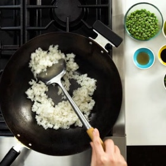

# [Fried Rice](https://www.seriouseats.com/easy-vegetable-fried-rice-recipe)
> **tags**: #Easy #5star

## Description

## Ingredients

- 2 cups cooked white rice (12 ounces; 350g; see note)
- 2 tablespoons (30ml) vegetable oil, divided
- 1 onion, finely chopped (4 ounces; 115g)
- 1 carrot, peeled and cut into small dice (3 ounces; 85g)
- 2 scallions, thinly sliced (1 ounce; 30g)
- 2 medium cloves garlic, minced (about 2 teaspoons; 5g)
- 1 teaspoon (5ml) soy sauce
- 1 teaspoon (5ml) toasted sesame oil
- salt
- ground white pepper
- 1 egg
- 4 ounces (115g) frozen peas

## Directions
If using day-old rice (see note), transfer to a medium bowl and break the rice up with your hands into individual grains before proceeding. Heat 1/2 tablespoon (7ml) vegetable oil in a wok over high heat until smoking. Add half of rice and cook, stirring and tossing, until the rice is pale brown and toasted and has a lightly chewy texture, about 3 minutes. Transfer to a medium bowl. Repeat with another 1/2 tablespoon oil and remaining rice.

Return all the rice to the wok and press it up the sides, leaving a space in the middle. Add 1/2 tablespoon (7ml) oil to the space. Add onion, carrot, scallions, and garlic and cook, stirring gently, until lightly softened and fragrant, about 1 minute. Toss with rice to combine. Add soy sauce and sesame oil and toss to coat. Season to taste with salt and white pepper.

Push rice to the side of the wok and add remaining 1/2 tablespoon (7ml) oil. Break the egg into the oil and season with a little salt. Use a spatula to scramble the egg, breaking it up into small bits. Toss the egg and the rice together.

Add frozen peas and continue to toss and stir until peas are thawed and every grain of rice is separate. Serve immediately.

## Notes

## Data
**prep** 5 mins | **cook** 20 mins | **total**  | **serves** 2 to 3 servings