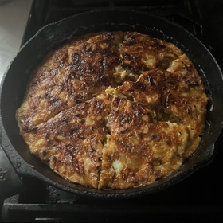

# [Frittata with Potatoes, Onion, and Rosemary](https://app.ckbk.com/recipe/marc71032c01s001ss001r003/frittata-with-potatoes-onion-and-rosemary)
> **tags**: #Dinner #5star

## Description

## Ingredients

- 1/2 pound potatoes
- 2 tablespoons olive oil
- 1 onion, sliced very thin, about 1 cup
- Salt
- 1/2 tablespoon rosemary leaves, chopped very fine
- 5 eggs
- Black pepper ground fresh

## Directions
Peel the potatoes, wash them in cold water, and slice them as thin as possible, potato-chip thin if you can. If you have a mandoline, this would be an appropriate use for it.

Put the olive oil and onion in a skillet, sprinkle with salt, and turn on the heat to low. Cook at low heat, turning the onion over occasionally, until it is very soft, but do not let it become brown.

Add the potatoes and the rosemary, turn over all ingredients three or four times, and cover the pan. Cook at low heat, turning the potatoes over from time to time, until they are tender, about 30 minutes.

Turn on the broiler.

While the potatoes are cooking, break the eggs into a bowl, add salt and several grindings of black pepper, and beat the eggs until the whites are indistinguishable from the yolks.

When the potatoes have become tender, pour the eggs into the skillet. Cook, uncovered, at very low heat. When the eggs have set and thickened, and they are creamy only in the center of the pan, run the skillet briefly under the broiler, proceeding as described in the directions for Basil Frittata.

## Notes

## Data
**prep**  | **cook**  | **total**  | **serves** For 4 persons or, if served as an appetizer, for 8