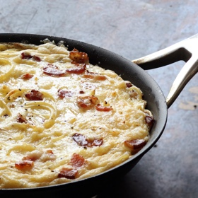

# [Frittata, Pasta](https://cooking.nytimes.com/recipes/6791-pasta-frittata)
> **tags**: #Eggs #To Try #5star

## Description

## Ingredients

- 1/4 pound spaghetti, linguine, fettuccine or other long pasta (or about 1/2 pound cooked pasta)
- Salt and pepper to taste
- 4 tablespoons butter or extra virgin olive oil
- 1/4 cup minced pancetta, bacon or prosciutto, optional
- 6 eggs
- 1 cup fresh grated Parmesan cheese

## Directions
If using leftover cooked pasta, chop it up. If using dried pasta, bring a large pot of water to a boil, and salt it. Cook pasta until barely tender, somewhat short of where you would normally cook it. Drain, and immediately toss it in a wide bowl with half the butter or oil. Cool it a bit.

Heat oven to 350 degrees. Put remaining butter or oil in a large nonstick ovenproof skillet, and turn heat to medium-high. If you are using meat, add it, and cook, stirring occasionally until crisp, 3 to 5 minutes. (If not using meat, proceed.)

In large bowl, combine pasta with remaining ingredients, along with salt and pepper (less salt if you are using meat). Pour into skillet, and turn heat to medium-low. Use a spoon if necessary to even out top of frittata. Cook undisturbed until mixture firms up on bottom, then transfer to oven. Bake just until top is set, about 10 minutes. Remove, and serve hot or at room temperature.

## Notes

## Data
**prep**  | **cook** 40 min | **total** 40 min | **serves** 4 to 6 servings