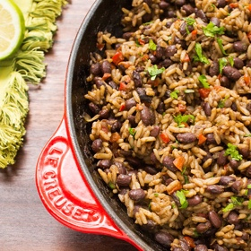

# [Gallo Pinto](https://stripedspatula.com/gallo-pinto/)
> **tags**: #Beans #Easy #5star

## Description

## Ingredients

- 2 tablespoons light-tasting oil (vegetable, mild olive, canola)
- 1 red bell pepper , chopped
- 1 small yellow onion , chopped
- 2 cloves garlic , minced
- 2 cups cooked black beans , in 3/4 cup reserved cooking liquid*
- 1/4 cup Salsa Lizano **
- 3 cups cooked rice , preferably, day-old and refrigerated
- 1/4 cup chopped fresh cilantro

## Directions
Heat oil in a large skillet over medium-high heat until shimmering. Sauté chopped bell pepper and onions until peppers are soft and onions are translucent, about 6-8 minutes. Add minced garlic and cook for 1 minute, until fragrant.

Add black beans, reserved cooking liquid, and Salsa Lizano, stirring to combine. Simmer for 5 minutes, until slightly thickened and little bit of the liquid is evaporated. Gently stir in cooked rice and cook until heated through and most of the liquid is absorbed, about 3-5 minutes.

Stir in chopped cilantro. Season to taste with additional Salsa Lizano, if desired, and serve.

## Notes
*Low-sodium canned beans in their liquid can be substituted here if time is of the essence. But, if you do have the time to soak and cook beans from dried, the flavor and texture will be a big reward!

## Data
**prep** 10 minutes | **cook** 20 minutes | **total**  | **serves** Servings: 8