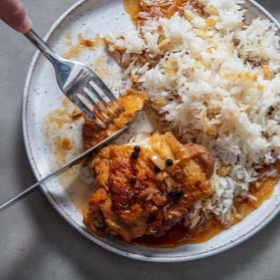

# [Garlic Fried Rice](https://www.seriouseats.com/garlic-fried-rice-recipe)
> **tags**: #Sides #5star

## Description

## Ingredients

- 1/4 cup plus 1 tablespoon (75ml) canola oil or other neutral oil
- 8 garlic cloves, crushed and sliced thinly
- 4 cups cooked white rice (24 ounces; 700g), preferably long-grain, but any variety will do

## Directions
In a small saucepan, heat oil over medium heat until shimmering. Add garlic and cook, stirring constantly, until garlic softens, becomes very aromatic, and turns lightly golden, 30 seconds to 1 minute. Strain oil through a fine-mesh strainer directly into a wok; reserve cooked garlic and set aside.

Heat wok over high heat until oil is shimmering. Add rice, breaking up larger clumps with a spatula and tossing to coat with garlic-flavored oil. Cook, stirring and tossing frequently, until no clumps of rice remain and rice is warmed through, about 4 minutes. Add reserved garlic to rice and toss to combine. Serve immediately.

## Notes

## Data
**prep**  | **cook** 5 mins | **total**  | **serves** 4 servings