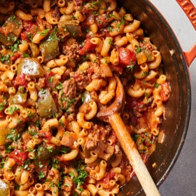

# [Goulash](https://cooking.nytimes.com/recipes/1024344-goulash)
> **tags**: #Untested #0star

## Description

## Ingredients

- 2 tablespoons olive oil
- 1 bell pepper, cut into 1/2-inch pieces
- 1 onion, chopped
- 2 tablespoons minced garlic (about 5 cloves)
- 2 teaspoons fresh thyme leaves, or 1 teaspoon dried thyme
- 1 1/2 teaspoons sweet paprika
- 1 1/2 teaspoons dried oregano
- 1 teaspoon salt
- Black pepper
- 1 pound ground beef (at least 85-percent lean)
- 1 tablespoon tomato paste
- 3 cups low-sodium beef broth, plus more as needed
- 1 (14-ounce) can crushed tomatoes
- 1 (14-ounce) can diced tomatoes
- 2 tablespoons Worcestershire sauce
- 1 1/4 cups uncooked macaroni
- 1 cup (4 ounces) shredded sharp Cheddar
- parsley, for serving

## Directions
In a large pot or Dutch oven, heat the olive oil over medium heat. Add the bell pepper and onion and cook, stirring occasionally, until the onion is translucent, 4 to 6 minutes. Add the garlic, thyme, paprika, oregano, salt and pepper and cook for 30 seconds, until the garlic is fragrant.

Add the ground beef and cook, stirring often and breaking up the meat with a spoon, until no longer pink, 3 to 5 minutes. Add the tomato paste and cook for 1 minute.

Pour in the broth, crushed and diced tomatoes and Worcestershire sauce; bring to a boil. Stir in the macaroni, reduce the heat to medium-low and cook, stirring occasionally and scraping the bottom of the pot, until the pasta is cooked and the liquid in the pan has thickened considerably, 18 to 20 minutes.

Remove from the heat and stir in the Cheddar. Taste for seasonings and add salt and pepper, if needed. Serve in bowls, topped with fresh parsley. (The goulash will continue to thicken as it sits. If desired, add a splash of beef broth when reheating.)

## Notes

## Data
**prep** 10 min | **cook** 40 min | **total** 50 min | **serves** 4 to 6 servings