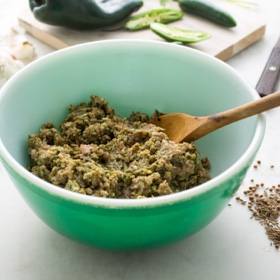

# [Green Chorizo](https://cooking.nytimes.com/recipes/1017246-fresh-green-chorizo)
> **tags**: #Mexican #5star

## Description

## Ingredients

- 1 pound ground pork
- 1 teaspoon whole black peppercorns
- 1 tablespoon whole coriander seeds
- 1/8 teaspoon whole cumin seeds
- 1/2 teaspoon dried oregano, preferably Mexican
- 1 dried bay leaf
- 4 whole cloves
- 8 garlic cloves (do not peel)
- 2 Serrano chiles
- 1 poblano chile
- 1/4 cup sherry vinegar
- 1 cup parsley leaves
- 1 tablespoon salt

## Directions
Place the ground pork in a large bowl. Set a cast-iron skillet over medium heat for 5 minutes. Add black peppercorns, coriander seeds, cumin seeds, oregano, bay leaf and cloves and toast briefly until fragrant, about 15 seconds. Remove from the heat, transfer to a spice grinder and grind to a fine powder. Add to the bowl with the ground pork.

Return the skillet to a high flame and heat for 5 minutes. Add garlic cloves, Serrano and poblano chiles and roast, turning them from time to time until softened slightly and blackened in spots, about 6 to 12 minutes, removing the pieces as they finish cooking. Set aside to cool at room temperature. Once garlic cloves are cool enough to handle, peel them and discard the skin. Wearing gloves if possible, remove the stems and seeds from the Serrano chiles. Remove the stems and seeds from the poblano chile, and peel away the charred skin.

In a blender, purée the roasted garlic cloves, Serrano and poblano chiles along with the sherry vinegar, parsley and kosher salt until smooth. Transfer to the bowl with the ground pork and spices.

Mix the chorizo with your (preferably gloved) hands until thoroughly combined. Transfer to a container and refrigerate until ready to use, or for up to 3 days. The chorizo can also be frozen in an airtight bag for up to 1 month.

## Notes

## Data
**prep**  | **cook** 30 min | **total** 30 min | **serves** 1 1/4 pounds sausage