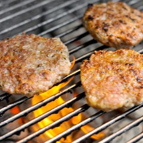

# [Grilled Breakfast Sausage](https://www.seriouseats.com/grilling-breakfast-sausage-recipe)
> **tags**: #Pork #0star

## Description

## Ingredients

### For the Sausage
- 2 pounds trimmed boneless pork butt (shoulder), diced into 1/2-inch cubes
- 1/2 pound fat back, diced into 1/2-inch cubes
- 2 teaspoons kosher salt
- 1 1/2 teaspoons ground black pepper
- 2 teaspoons fresh sage leaves, finely chopped
- 2 teaspoons fresh thyme leaves, finely chopped
- 1/2 teaspoon fresh rosemary leaves, finely chopped
- 1 tablespoon light brown sugar
- 1/2 teaspoon fresh grated nutmeg
- 1/2 teaspoon cayenne pepper
- 1/2 teaspoon red pepper flakes

### For the Test Patty
- 1 teaspoon vegetable oil

## Directions
Add pork butt, fatback, salt, pepper, sage, thyme, rosemary, brown sugar, nutmeg, cayenne, and pepper flakes to medium bowl and toss to combine. Refrigerate for at least 1 hour.

Using 1/4-inch die, grind mixture in chilled meat grinder into a medium bowl set in a larger bowl of ice water.

Heat 1/2 teaspoon of oil in a small skillet over medium heat. When oil is shimmering, cook a 1 tablespoon-sized patty of sausage mixture until browned and cooked through, about 1 1/2 minutes. Taste patty and adjust salt and spice level of mixture as needed. Form mixture into 3 ounce patties, about 1/2-inch thick, and 3-inches wide.

Light one chimney full of charcoal. When all the charcoal is lit and covered with gray ash, pour out and spread the coals evenly over entire surface of coal grate. Set cooking grate in place, cover grill and allow to preheat for 5 minutes. Clean and oil cooking grate. Grill patties over high heat until browned and cooked through flipping once half way through, 7 to 10 minutes total. Remove patties from grill, allow to rest for 3 minutes, and serve.

## Notes

## Data
**prep** 50 mins | **cook** 15 mins | **total**  | **serves** 12 to 14 servings