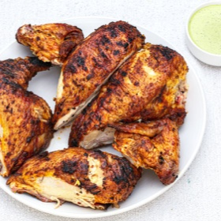

# [Grilled Chicken, Peruvian-Style with Green Sauce](https://www.seriouseats.com/peruvian-style-grilled-chicken-with-green-sauce-recipe)
> **tags**: #Chicken #5star

## Description

## Ingredients

### For the Sauce
- 3 whole jalapeño chiles, roughly chopped (see notes)
- 1 tablespoon (15ml) ají amarillo pepper paste (see notes)
- 1 cup fresh cilantro leaves (1 ounce; 28g)
- 2 medium cloves garlic
- 1/2 cup (120ml) mayonnaise
- 1/4 cup (60ml) sour cream
- 2 teaspoons (10ml) fresh juice from 1 lime
- 1 teaspoon (5ml) distilled white vinegar
- 2 tablespoons (30ml) extra-virgin olive oil
- Kosher salt and freshly ground black pepper

### For the Chicken
- 1 whole chicken, 3 1/2 to 4 pounds (1.6 to 1.8kg)
- 4 teaspoons (12g) kosher salt
- 2 tablespoons (18g) ground cumin
- 2 tablespoons (18g) paprika
- 1 teaspoon (3g) freshly ground black pepper
- 3 medium cloves garlic, minced (about 1 tablespoon)
- 2 tablespoons (30ml) white vinegar
- 2 tablespoons (30ml) vegetable or canola oil

## Directions
For the Sauce: Combine jalapeños, ají amarillo (if using), cilantro, garlic, mayonnaise, sour cream, lime juice, and vinegar in the jar of a blender. Blend on high speed, scraping down sides as necessary, until smooth. With blender running, slowly drizzle in olive oil. Season to taste with salt and pepper. Sauce will be quite loose at this point, but will thicken as it sits. Transfer to a sealed container and refrigerate until ready to use.

Melissa Hom

For the Chicken: Pat chicken dry with paper towels and place on a large cutting board, breast side down. Using sharp kitchen shears, remove backbone by cutting along either side of it. Turn chicken over and lay out flat. Press firmly on breast to flatten chicken. For added stability, run a metal or wooden skewer horizontally through chicken, entering through one thigh, going through both breast halves, and exiting through other thigh. Tuck wing tips behind back.

## Notes

## Data
**prep** 10 mins | **cook** 85 mins | **total**  | **serves** 4 servings