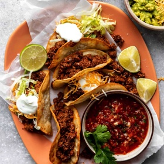

# [Ground Beef Taco](https://houseofyumm.com/best-ever-taco-meat/)
> **tags**: #Mexican #0star

## Description

## Ingredients

- 1X 2X 3X
- 1 lb ground beef 70-80% lean*
- 1 tbsp chili Powder
- 1/2 tsp salt
- 3/4 tsp cumin
- 1/2 tsp dried Mexican oregano
- 1/4 tsp granulated garlic
- 1/4 tsp granulated onion
- 1/2 cup tomato sauce
- TACO SHELLS
- 8 white corn tortillas
- 1/2 cup oil avocado or vegetable

## Directions
Cook Ground Beef: Heat a large skillet over medium heat. Add the ground beef. Break the beef up with a wooden spoon while cooking. Cook the ground beef fully, until browned and no longer pink.

Drain: Drain any excess grease from the skillet. Then return to the stove and reduce the heat to low.

Season: Add the 1/2 cup tomato sauce and taco seasoning. Stir together until the meat is coated in the sauce.

Simmer: Allow to simmer for 5 minutes.

Fry Tortillas: Pour 1/2 cup oil in a medium size skillet, heat over medium high heat. Carefully dip a tortilla, if the oil sizzles and bubbles then it's hot enough. Gently lay the tortilla in the oil and fry each side for about 30 seconds, just enough to give some color and add some crispness.

Shape Tortillas: Remove the tortilla to a paper towel to absorb oil, and carefully fold the tortilla over to create a taco shape. I do this with my tongs, or two forks, whatever I'm using to lay the tortillas in the oil and remove them.

Toppings: Fill the tortillas with the ground beef taco meat and add desired toppings

## Notes
Ground Beef: Using 80/20 ground beef, this keeps the meat flavorful, but not greasy.

Ground Beef Substitution: instead of ground beef use ground chicken or turkey.

Extra Veggies: looking to add some more veggies? Chop up some peppers, zucchini, and carrots to sauté with the meat while it cooks.

Control the Heat: if you are wanting to add more heat to this recipe sprinkle some crushed red pepper into the seasoning blend according to your preference.

Tortillas: Taco shells shown are white corn tortillas that have been fried in canola oil.

## Data
**prep** 5 mins | **cook** 20 mins | **total**  | **serves** 4