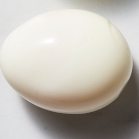

# [Hard Boiled Eggs](https://cooking.nytimes.com/recipes/1020468-perfect-boiled-eggs)
> **tags**: #Eggs #Steph #0star

## Description

## Ingredients

## Directions
Find a lidded saucepan large enough to allow your eggs to comfortably fit on the bottom in a single layer. Add 1 inch of water, cover and bring to a boil.

Gently lower eggs into the saucepan using a slotted spoon or a steamer basket. (It’s O.K. if the eggs are partly submerged on the bottom of the pot, or elevated on a steamer rack and not submerged at all.) Cover pan and cook eggs, adjusting the burner to maintain a vigorous boil, 6 minutes for a warm liquid yolk and firm whites, 8½ minutes for a translucent, fudgy yolk or 11 minutes for a yolk that is just barely firm all the way through.

Drain eggs, then peel and eat immediately, or transfer them to a plate and allow them to cool naturally before storing in the refrigerator for up to a week directly in their shell. (A small dot made with a permanent marker on the top of each cooked egg will ensure you don’t mix them up with the raw eggs.) Do not shock them in an ice bath after cooking; this makes them more difficult to peel.

## Notes
On a regular home burner, you can cook as many eggs as will fit in a single layer in your pot, up to around a dozen. (Any more and the temperature in the pot will affect cooking.) A steamer basket is not necessary, but it can help you raise and lower eggs gently, preventing accidental cracks. If you have trouble with eggs cracking during cooking, use a pushpin to poke a small hole through the shell on the fat end of the eggs. (This can also help minimize the dimple that forms on the cooked egg white due to an internal air pocket.) The eggs in this recipe should be cooked straight from the refrigerator; reduce cooking times by 1 minute if using room-temperature eggs.

## Data
**prep**  | **cook** 10 min | **total** 10 min | **serves** 