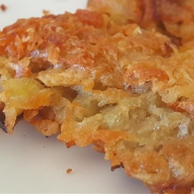

# [Hash Browns](https://www.allrecipes.com/recipe/57783/emilys-famous-hash-browns/)
> **tags**: #Potato #0star

## Description

## Ingredients

- 2 medium russet potatoes, shredded
- 1/2 medium onion, finely chopped
- 1/4 cup all-purpose flour
- 1 egg
- 1 cup oil for frying, or as needed
- salt and pepper to taste

## Directions
Gather all ingredients.

Rinse shredded potatoes until water is clear, then drain and squeeze dry.

Place shreds in a bowl and mix in the onion, flour, and egg until evenly distributed.

Heat about 1/4 inch of oil in a large heavy skillet over medium-high heat. When oil is sizzling hot, place potatoes into the pan in a 1/2 inch thick layer. Cover the whole bottom of the pan, or make separate piles like pancakes.

Cook until nicely browned on the bottom, then flip over and brown on the other side. It should take at least 5 minutes per side. If you are cooking them in one big piece, it can be cut into quarters for easier flipping.

Remove from pan, and drain on paper towels. Season with salt and pepper and serve immediately.

Serve hot and enjoy!

## Notes

## Data
**prep** 20 mins | **cook** 15 mins | **total**  | **serves** 4