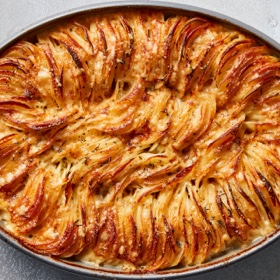

# [Hasselback Potato Gratin](https://cooking.nytimes.com/recipes/1017724-cheesy-hasselback-potato-gratin)
> **tags**: #Potato #5star

## Description

## Ingredients

- 3 ounces finely grated Gruyère or comté cheese
- 2 ounces finely grated Parmigiano-Reggiano
- 2 cups heavy cream
- 2 medium cloves garlic, minced
- 1 tablespoon fresh thyme leaves, roughly chopped
- Kosher salt and black pepper
- 4 to 4 1/2 pounds russet potatoes, peeled and sliced 1/8-inch thick on a mandoline slicer (7 to 8 medium, see note)
- 2 tablespoons unsalted butter

## Directions
Adjust oven rack to middle position and heat oven to 400 degrees. Combine cheeses in a large bowl. Transfer 1/3 of cheese mixture to a separate bowl and set aside. Add cream, garlic and thyme to cheese mixture. Season generously with salt and pepper. Add potato slices and toss with your hands until every slice is coated with cream mixture, making sure to separate any slices that are sticking together to get the cream mixture in between them.

Grease a 2-quart casserole dish with butter. Pick up a handful of potatoes, organizing them into a neat stack, and lay them in the casserole dish with their edges aligned vertically. Continue placing potatoes in the dish, working around the perimeter and into the center until all the potatoes have been added. The potatoes should be very tightly packed. If necessary, slice an additional potato, coat with cream mixture, and add to casserole. Pour the excess cream/cheese mixture evenly over the potatoes until the mixture comes halfway up the sides of the casserole. You may not need all the excess liquid.

Cover dish tightly with foil and transfer to the oven. Bake for 30 minutes. Remove foil and continue baking until the top is pale golden brown, about 30 minutes longer. Carefully remove from oven, sprinkle with remaining cheese, and return to oven. Bake until deep golden brown and crisp on top, about 30 minutes longer. Remove from oven, let rest for a few minutes, and serve.

## Notes
Because of variation in the shape of potatoes, the amount of potato that will fit into a single casserole dish varies. Longer, thinner potatoes will fill a dish more than shorter, rounder potatoes. When purchasing potatoes, buy a few extra in order to fill the dish if necessary. Depending on exact shape and size of potatoes and casserole dish, you may not need all of the cream mixture.

## Data
**prep**  | **cook**  | **total** 2 hr | **serves** 6 servings