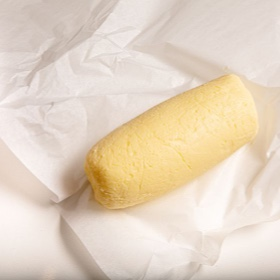

# [Homemade Butter](https://www.seriouseats.com/how-to-make-butter-7496926)
> **tags**: #Dairy #5star

## Description

## Ingredients

- 1 quart (946ml) heavy cream or crème fraîche (see notes)
- Kosher or sea salt (optional)

## Directions
In a stand mixer fitted with the whisk attachment or in a food processor or in a large mixing bowl with a whisk, beat cream until it reaches and then passes the whipped stage, large globules of butterfat coalesce, and liquid begins sloshing all around it. The timing for this can vary depending on the tool used and the type of cream used, but can take up to about 15 minutes in a stand mixer (crème fraîche, in our experience, turns to butter much, much faster).

Drain buttermilk from butterfat, saving buttermilk for another use (such as to drink). Place butter in mixing bowl, fill with cold water, and gently knead, forming butterfat into a single mass as you wash away any remaining buttermilk. Drain and repeat washing in cold water until water is clear.

Drain butter one final time, then gently knead on a clean work surface to express any remaining water, blotting with clean towels to dry as needed. If seasoning butter with salt, sprinkle salt on top and knead it in until evenly distributed.

Form butter into an even, compressed shape, such as a log. Wrap tightly in plastic or waxed paper, and keep refrigerated.

## Notes

## Data
**prep** 20 mins | **cook** 20 mins | **total**  | **serves** 12 ounces