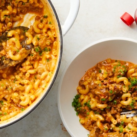

# [Homemade Hamburger Helper](https://cooking.nytimes.com/recipes/1020728-homemade-hamburger-helper)
> **tags**: #Dinner #0star

## Description

## Ingredients

- 1/4 cup neutral oil, such as canola or vegetable
- 1 large yellow onion, diced into 1/2-inch pieces
- Salt and black pepper
- 3 garlic cloves, minced
- 5 strips uncooked smoked bacon, finely chopped
- 1 pound ground beef
- 1 cup dry white wine
- 3 cups chicken stock or water
- 3/4 cup heavy cream
- 1/4 to 1/3 cup hot sauce
- 2 teaspoons hot smoked paprika
- 1 bay leaf
- 8 ounces elbow pasta
- 5 slices American cheese, ripped into small pieces
- 1 1/2 cups grated Cheddar
- 1/2 cup finely chopped chives

## Directions
Heat a large (12-inch) sauté pan or Dutch oven over medium-low, and add oil and onion; season lightly with salt and pepper. (The hot sauce added in Step 6 will add a lot of flavor, so be careful not to overseason here.) Let cook until the onions turn light beige in color and begin to caramelize, 20 to 25 minutes.

Add garlic and cook until fragrant and starting to brown ever so slightly, about 2 minutes.

Increase heat to medium-high and add bacon and ground beef, using the back of a large spoon to break up the meat into smaller pieces. Continue to cook until the liquid has mostly evaporated and the meat starts to sear and develop a crust on the bottom of the pan, 12 to 15 minutes.

Remove pan from the heat and carefully drain off most of the fat, leaving a little in the pan to keep the meat moist.

Return pan to medium-high heat and add white wine, allowing it to reduce until the mixture is almost dry, about 10 minutes.

Add the chicken stock, heavy cream, hot sauce, paprika and bay leaf to the pan. Mix until combined and bring to a boil.

Once the mixture is boiling, add the pasta and cook until al dente, stirring often, about 9 minutes.

Reduce the heat to low and stir in both types of cheese, stirring until completely melted and sauce is thickened.

Remove the pan from heat, stir in chives and season to taste with salt and pepper. Serve immediately.

## Notes

## Data
**prep**  | **cook**  | **total** 1 hr 15 min | **serves** 4 servings