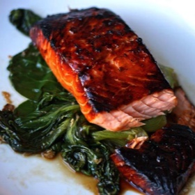

# [Honey-Soy Glazed Salmon with Bok Choy](https://www.seriouseats.com/dinner-tonight-broiled-honey-soy-teriyaki-salmon-with-boy-choy-recipe)
> **tags**: #Fish #5star

## Description

## Ingredients

- 1 cup soy sauce
- 1/4 cup honey
- 2 tablespoons lemon juice
- 1 inch peeled fresh ginger, thinly sliced
- 3 cloves garlic
- 4 salmon fillets, about 1 1/2 pounds
- 4-6 heads baby bok choy, root ends trimmed off

## Directions
Whisk soy sauce, honey, lemon juice, ginger, and garlic together until honey dissolves. Reserve 1/4 cup of marinade in separate bowl, then place salmon fillets, skin-side up, in marinade. Allow to marinate for at least 10 minutes, preferably for 30.

Meanwhile, preheat broiler (or grill) to high. Heat 1/4 cup of water in medium skillet over high heat and bring to a boil. Add bok choy and cover. Allow to steam until almost tender, about 4 minutes, then add reserved marinade. Toss to combine, cook for an additional 2 minutes to reduce excess liquid. Remove from heat.

Put the salmon under the broiler skin-side down and broil without turning until exterior is well-caramelized and the fish is just cooked through, 7-10 minutes, depending on thickness and the distance from broiler.

Arrange bok choy on plates and top with the salmon fillets.

## Notes

## Data
**prep** 5 mins | **cook** 10 mins | **total**  | **serves** 4 servings