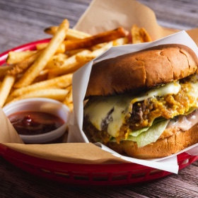

# [In-N-Outs Double-Double, Animal Style](https://www.seriouseats.com/in-n-outs-double-double-animal-style-burger-recipe)
> **tags**: #Mains #5star

## Description

## Ingredients

### For the Sauce
- 3 tablespoons (45ml) mayonnaise
- 1 tablespoon (15ml) ketchup
- 2 teaspoons (10g) sweet pickle relish
- 1/2 teaspoon sugar
- 1/2 teaspoon distilled white vinegar

### For the Burgers
- 8 ounces (225g) fresh beef chuck with plenty of fat, cut into 1-inch cubes
- 2 teaspoons (10ml) vegetable oil, divided
- 1 large onion, finely chopped (about 1 1/2 cups)
- Kosher salt
- 2 soft Hamburger buns, preferably Arnold brand
- Freshly ground black pepper
- 8 dill pickles chips
- 2 quarter-inch-thick slices ripe tomato
- 2 leaves fresh iceberg lettuce, white core section removed, torn to bun-sized pieces
- 1/4 cup (60ml) yellow mustard
- 4 slices deli-cut American Cheese

## Directions
For the Sauce: Combine all ingredients in a small bowl, and stir to combine. Cover and refrigerate until ready to use (sauce can be refrigerated up to 5 days).

Andrew Janjigian

For the Burgers:

If using a meat grinder: Place feed shaft, blade, and 1/4-inch die of meat grinder in freezer until well-chilled. Meanwhile, place meat chunks on rimmed baking sheet, leaving space between each piece and place in freezer for 10 minutes until meat is firm. Combine meat in large bowl and toss to combine. Grind meat and refrigerate immediately until ready to use. Handle as gently as possible. Proceed to step 3.

If using a food processor: Place bowl and blade of food processor in freezer until well-chilled. Meanwhile, place meat chunks on rimmed baking sheet, leaving space between each piece, and place in freezer for 10 minutes until meat is firm, but not frozen. Combine meat in large bowl and toss to combine. Working in two batches, place meat cubes in food processor and pulse until medium-fine grind is achieved, 8 to 10 one-second pulses, scraping down processor bowl as necessary. Refrigerate ground meat immediately until ready to use. Handle as gently as possible.

Andrew Janjigian

Preheat oven or toaster oven to 400°F (200°C). Meanwhile, in a 10-inch nonstick skillet, heat 1 teaspoon (5ml) oil over medium-high heat until shimmering. Add onion and 1/2 teaspoon salt, reduce heat to medium-low, and cook, tossing and stirring occasionally, until onions are well browned, about 15 minutes. Once onions begin to sizzle heavily and appear dry, add 1 tablespoon (15ml) water to skillet and stir to scrape up any browned bits. Continue cooking until water evaporates and onions start sizzling again, about 1 minute. Repeat process, adding 1 tablespoon (15ml) of water at a time, until onions are meltingly soft and dark brown, about 3 times total. Transfer to a small bowl and set aside.

Place closed buns in preheated oven until slightly darkened and crisped, about 2 minutes. In a 12-inch skillet, heat 1/2 teaspoon oil over medium-high heat until shimmering. Open buns and add face-down to skillet. Toast until dark brown around the edges, about 1 minute total. Transfer buns to a plate or tray; wipe out skillet. Spread sauce on bottom halves of each bun, then top each with 4 pickle slices, 1 slice tomato, and 1 lettuce leaf. Set aside.

Form ground beef into four 2-ounce balls. Using damp hands, press each into a patty that is 3/16-inch-thick, and 4 inches in diameter. Season generously with salt and pepper.

In now-empty skillet, heat remaining 1/2 teaspoon oil over medium-high heat until lightly smoking. Add beef patties and cook without moving until well browned and crusty on bottom side, about 2 minutes and 30 seconds. Using a spoon, spread 1 tablespoon (15ml) mustard on raw side of each patty. Using a spatula, flip patties so mustard side is down, and continue to cook for 1 minute. Top each patty with 1 slice of cheese. Divide onion mixture evenly between two patties. Place the other two patties directly on top of the onion-topped patties. Transfer burger stacks to prepared bottom buns. Close sandwiches, and serve immediately.

Andrew Janjigian

## Notes

## Data
**prep** 30 mins | **cook** 35 mins | **total**  | **serves** 2 burgers