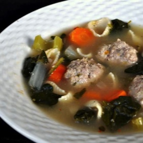

# [Italian Honeymoon Soup](https://www.seriouseats.com/italian-honeymoon-soup-recipe)
> **tags**: #Soup #5star

## Description

## Ingredients

### For the Meatballs
- 3/4 pound ground turkey
- 3 cloves garlic, minced
- 2 teaspoons thyme
- 1 extra large egg, lightly beaten
- 1/4 cup panko breadcrumbs
- 1 teaspoon lemon zest
- 2 1/2 tablespoons finely chopped parsley
- 1/2 teaspoon black pepper
- Scant 1 teaspoon sea salt
- 1/4 cup grated Parmesan cheese
- 2 1/2 tablespoons olive oil
- 1 onion, chopped
- 2 carrots, peeled and chopped
- 2 ribs celery, chopped
- 12 cups chicken broth
- 3 sprigs thyme
- 10 ounces baby spinach
- 1 cup small pasta
- 1 tablespoon lemon juice
- Chopped parsley, for garnish
- Grated Parmesan cheese, for garnish

## Directions
In a large bowl, stir together all ingredients for meatballs until well combined. If mixture seems dry, add 1 tablespoon water.

Roll turkey mixture into 1 1/2 inch balls. Place meatballs on a baking sheet, cover with plastic wrap, and refrigerate for 30 minutes.

Heat olive oil in a large pot over medium high heat. Add onion, carrots, and celery. Cook, stirring occasionally, until softened and beginning to brown, about 10 minutes.

Add chicken broth and sprigs of thyme bring to a simmer. Add meatballs and cook for 10 minutes. Stir in spinach, pasta, and lemon juice. Cook until pasta is tender, about 5 minutes, depending on size. Season soup with salt and pepper to taste. Remove stalks of thyme.

Serve soup with chopped parsley and freshly grated Parmesan as a garnish.

## Notes

## Data
**prep** 30 mins | **cook** 90 mins | **total**  | **serves** 6 servings