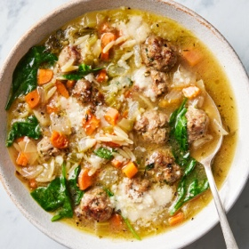

# [Italian Wedding Soup](https://cooking.nytimes.com/recipes/1024492-italian-wedding-soup?ds_c=71700000052595478&gad_source=1&gbraid=0AAAAADwd30gVv97mQDFqrewItOH4gLQIi&gclid=EAIaIQobChMIzsK4-NCDgwMVsV5HAR3B1gWfEAAYASAAEgI6HvD_BwE&gclsrc=aw.ds)
> **tags**: #Soup #0star

## Description

## Ingredients

- 1 large egg
- 1/2 pound ground beef
- 1/2 pound ground pork
- 1/2 cup Italian bread crumbs or panko
- 1/3 cup grated Parmesan
- 3 tablespoons chopped fresh parsley
- 2 large garlic cloves, minced (about 1 tablespoon)
- 1 teaspoon dried oregano
- 1 teaspoon kosher salt (such as Diamond Crystal)
- 1/2 teaspoon black pepper
- Olive oil, for forming the meatballs
- 3 tablespoons olive oil
- 1 large yellow onion, chopped (about 2 cups)
- 3 medium carrots, diced (about 2 cups)
- 2 to 3 large celery ribs, diced (about 11/2 cups)
- 2 large garlic cloves, minced (about 1 tablespoon)
- Kosher salt (such as Diamond Crystal) and black pepper
- 8 cups (2 quarts) chicken broth, plus more as needed
- 1/2 cup acini di pepe, ditalini or orzo
- 3 cups packed baby spinach
- Grated Parmesan, for serving

## Directions
Make the meatballs: Crack the egg into a large bowl and beat it lightly with a fork. Add the beef, pork, bread crumbs, Parmesan, parsley, garlic, oregano, salt and pepper. Mix gently but thoroughly, until incorporated. Coat your hands with olive oil, then form small meatballs using 1 heaping teaspoon of the mixture per meatball; transfer to a plate or sheet pan. You should have about 80 (1-inch) meatballs.

Make the soup: In a large pot or Dutch oven, heat the olive oil over medium heat. When the oil is hot, fry the meatballs in 2 batches, turning occasionally, until mostly browned all over, 3 to 4 minutes. Transfer to a paper towel-lined plate. 

Add the onion, carrots and celery to the pot and cook, stirring occasionally, until the vegetables are crisp-tender, about 10 minutes. Add the garlic, 1 teaspoon of salt (or 2 teaspoons if you’re using low-sodium broth) and ½ teaspoon black pepper. Cook until the garlic is fragrant, about 1 minute.

Return the meatballs to the pot, add the broth and bring to a simmer over medium-high heat. Stir in the pasta, lower the heat and simmer, stirring occasionally, until the pasta is tender, about 10 minutes. 

Turn off the heat and stir in the spinach until wilted. Taste and season with salt and pepper, if needed. (The broth should taste pleasantly salty.) Serve hot, topped with Parmesan. The pasta will continue to absorb liquid as the soup sits; you may need to add broth when reheating. Soup will keep for up to 5 days in the refrigerator or 3 months in the freezer (see Tip).

## Notes
To freeze, cool soup to room temperature in the pot, then transfer to airtight containers and freeze for up to 3 months. Thaw overnight in the fridge, or run the container under hot tap water until the soup releases. Transfer to a pot and bring to a simmer, partially covered, adding more water or broth if necessary.

## Data
**prep** 15 min | **cook** 1 min | **total** 1 hr 15 min | **serves** 6 to 8 servings