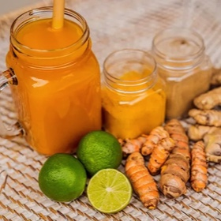

# [Jamu](https://eatsimplefood.com/jamu/)
> **tags**: #Drinks #4star

## Description

## Ingredients

- 1.5 oz fresh turmeric
- 1.5 oz fresh ginger
- 6 cups water
- 3 Tbsp honey
- 1 lime, juiced
- 1 1/2 Tbsp Tamarind paste
- pinch of black pepper or coconut oil - optional

## Directions
Slice rinsed ginger and turmeric (leave skin on).

Add water, ginger, and turmeric to a large stockpot. Bring to a boil (covered), reduce heat and simmer for ~ 30 minutes.

Transfer to a blender and add honey, lime, and tamarind paste (may need to do in batches if necessary). Blend it. Careful - it's HOT!

Strain it! (Save the solids for soups/stews/tea/eggs/whatever!) Drink hot or cold.

Jamu keeps in the refrigerator 5-6 days.

## Notes
Black pepper or coconut oil are not in a traditional Jamu recipe but makes the anti-inflammatory benefits of turmeric more available for your body to absorb.

Like it sweeter? Add more honey.

To spicy for your liking? Cool, reduce the amount of ginger.

Tamarind darkens the color of this jamu drink. If you want a beautiful & clear yellow/orange, then skip the tamarind paste and just use lime.

Don't have or can't find tamarind paste? Skip it, use a little extra lime juice instead.

Don't have lime, but have lemon on hand? Cool, substitute the citrus for what you got.

## Data
**prep** 5 minutes | **cook** 25 minutes | **total**  | **serves** Yield: 6 cups