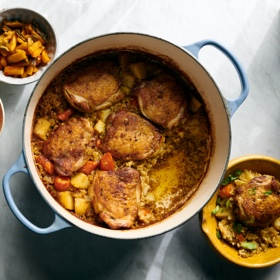

# [Japanese Curry Chicken and Rice](https://cooking.nytimes.com/recipes/1021201-one-pot-japanese-curry-chicken-and-rice)
> **tags**: #Dinner #5star

## Description

## Ingredients

- 2 pounds bone-in, skin-on chicken thighs (about 6 large thighs)
- 2 tablespoons canola oil
- Salt
- black pepper
- 3 tablespoons unsalted butter
- 1/2 cup onion, chopped
- 3 tablespoons Madras curry powder
- 1 tablespoon garlic, minced
- 1 tablespoon ginger, minced
- 3/4 teaspoon ground nutmeg
- 1 1/2 cups short-grain white rice, rinsed until water runs clear
- 1 large baking potato (about 1 pound), such as russet, white or Idaho, peeled and cut into 1/2-inch cubes
- 3 carrots, sliced 1/2-inch thick
- 3 1/2 cups chicken broth
- 2 tablespoons Worcestershire sauce
- Chopped scallions, pickles, kimchi and/or hot sauce, for serving

## Directions
Heat oven to 375 degrees. Rub chicken with 1 tablespoon oil, and season with salt and pepper.

In a large Dutch oven or heavy pot, heat remaining 1 tablespoon oil with 1 tablespoon butter over medium until butter is melted. Working in two batches, brown chicken 3 to 4 minutes per side, and transfer to a plate.

Add onion to the pot, season with salt and pepper, and cook, stirring, until softened, 2 minutes. Add curry powder, garlic, ginger, nutmeg and the remaining 2 tablespoons butter, and stir until butter is melted and spices are fragrant, 1 minute.

Add rinsed rice and stir until evenly coated in spices. Add potato, carrots, broth and Worcestershire sauce, scraping bottom of pot to lift up any browned bits. Season broth generously with salt and pepper. Arrange chicken (and any accumulated juices) on top, skin side up, and bring to a boil over high. Cover and bake for 20 minutes. Uncover and bake until most of the liquid is absorbed and chicken is golden and cooked through, about 10 minutes longer.

Divide chicken and rice among bowls, and garnish with scallions. Serve with any combination of pickles, kimchi and hot sauce.

## Notes

## Data
**prep**  | **cook** 1 hr | **total** 1 hr | **serves** 4 servings