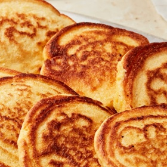

# [Johnny Cakes](https://www.thekitchn.com/johnny-cakes-recipe-23126601)
> **tags**: #Charlie #4star

## Description

## Ingredients

- 1 cup all-purpose flour
- 1 cup yellow cornmeal
- 2 1/2 teaspoons baking powder
- 1 teaspoon kosher salt
- 2 large eggs
- 3/4 cup whole milk or buttermilk
- 1/4 cup water
- 1/2 cup pork fat, rendered lard, bacon grease, or vegetable oil
- 2 tablespoons unsalted butter

## Directions
Place 1 cup all-purpose flour, 1 cup yellow cornmeal, 2 1/2 teaspoons baking powder, and 1 teaspoon kosher salt in a medium bowl and whisk to combine.

Beat 2 large eggs in a small bowl until broken up. Add the eggs, 3/4 cup whole milk or buttermilk, and 1/4 cup water to the flour mixture and stir to combine.

Heat 1/2 cup pork fat and 2 tablespoons unsalted butter in a cast iron pan over medium-high heat until melted and shimmering. Use a 1/4-cup measuring cup to drop two portions of the batter into the pan. Cook until crisp and golden brown, about 5 minutes per side. Transfer to a plate and repeat with the remaining batter.

## Notes

## Data
**prep**  | **cook**  | **total**  | **serves** 12 to 15