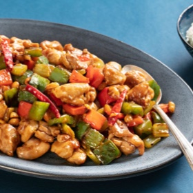

# [Kung Pao Chicken, Chinese American](https://www.seriouseats.com/takeout-style-kung-pao-chicken-diced-chicken-peppers-peanuts-recipe)
> **tags**: #Asian #5star

## Description

## Ingredients

### For the Chicken
- 1 1/2 pounds (680g) boneless skinless chicken thighs, cut into 3/4-inch chunks (see note)
- 1 teaspoon (5ml) dark soy sauce
- 1 teaspoon (5ml) Shaoxing wine (see note)
- 1/2 teaspoon sugar
- 1/2 teaspoon toasted sesame oil
- 1/2 teaspoon cornstarch
- 1/2 teaspoon Diamond Crystal kosher salt; for table salt use half as much by volume
- 1/4 teaspoon ground white pepper

### For the Stir-Fry
- 2 tablespoons (30ml) homemade or store-bought low-sodium chicken stock
- 1 tablespoon (15ml) dark soy sauce
- 1 tablespoon (15ml) Shaoxing wine
- 1 tablespoon (15ml) distilled white vinegar
- 1 tablespoon (15g) sugar
- 2 teaspoons (5g) cornstarch
- 1 teaspoon toasted (5ml) sesame oil
- 3 tablespoons (45ml) vegetable, peanut, or canola oil, divided
- 1 large red bell pepper, cut into 3/4-inch dice
- 1 large green bell pepper, cut into 3/4-inch dice
- 2 stalks celery, cut into 3/4-inch dice
- 1/2 cup (100g) roasted peanuts
- 2 teaspoons (5g) minced fresh garlic (about 2 medium cloves)
- 2 teaspoons (5g) minced fresh ginger
- 1 scallion, white and light green parts only, finely minced
- 8 small dried red Chinese or Arbol chiles (see note)

## Directions
For the Chicken: Combine chicken, soy sauce, wine, sugar, sesame oil, cornstarch, salt, and pepper in a medium bowl and toss to coat. Set aside for 20 minutes.

Melissa Hom

For the Stir-Fry: Combine chicken stock, soy sauce, wine, vinegar, sugar, cornstarch, and sesame oil in a small bowl and whisk together until homogenous. Set aside.

Heat 1 tablespoon oil in a wok over high heat until smoking. Add chicken, spread into a single layer, and cook without moving until lightly browned, about 1 minute. Continue cooking, tossing and stirring frequently, until the exterior is opaque but chicken is still slightly raw in the center, about 2 minute longer. Transfer to a clean bowl and set aside.

Wipe out wok and heat remaining 2 tablespoons oil over high heat until smoking. Add bell peppers and celery and cook, stirring and tossing occasionally, until brightly colored and browned in spots, about 1 minute. Add peanuts and toss to combine.

Push vegetables up side of wok to clear a space in the center. Add garlic, ginger, scallions, and dried chiles and cook, stirring, until fragrant, about 30 seconds. Return chicken to wok and toss to combine. Stir sauce and add to wok. Cook, tossing, until sauce thickens and coats ingredients and chicken is cooked through, about 1 minute longer. Serve immediately.

Melissa Hom

## Notes
If you can't find boneless skinless chicken thighs, you can debone them yourself using this guide. Shaoxing wine can be found in most Asian markets. If unavailable, dry sherry can be used in its place. If you can't find whole dried chiles, substitute with 1/4 teaspoon crushed red pepper flakes.

## Data
**prep** 35 mins | **cook** 15 mins | **total**  | **serves** 4 servings