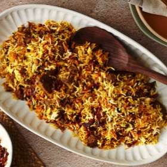

# [Lamb Biryani](https://www.seriouseats.com/lamb-biryani)
> **tags**: #Mains #To Try #0star

## Description

## Ingredients

- 2 pounds (910g) boneless leg of lamb, trimmed of excess fat and cut into 1-inch (2cm) cubes
- 1 cup plain, unsweetened full-fat yogurt
- 6 medium garlic cloves, peeled and finely grated
- One 2–inch piece fresh ginger, peeled and grated
- 3 teaspoons Diamond Crystal kosher salt, divided; if using table salt, use half as much by volume
- 1/4 cup (60 ml) plus 2 teaspoons (10ml) ghee or neutral oil, such as grapeseed, divided
- 2 large yellow or white onions (26 ounces; 750g total), sliced thinly
- 5 green cardamom pods, lightly cracked, divided
- 1 cinnamon stick
- 4 cloves
- 2 dried bay leaves
- 1 teaspoon garam masala, store-bought or homemade
- 1 teaspoon ground Kashmiri chile (see note)
- 1/2 teaspoon ground mace
- 1/2 teaspoon ground turmeric
- 1 cup (240ml) water or low-sodium stock (lamb, beef, or chicken)
- 2 cups (400g) basmati rice
- 1/4 cup (60ml) fresh lemon or lime juice
- 1 bunch fresh cilantro leaves and tender stems, chopped
- 1 bunch fresh mint leaves, chopped
- 1 fresh green chile, such as a serrano or Thai bird, minced
- 1/4 cup (60ml) whole milk
- 20 strands of saffron, divided
- 2 teaspoons rosewater
- 2 teaspoons pandan (kewra/screwpine) water (see note)

## Directions
Place lamb in a 1 gallon (3.8L) zip-top bag. In a medium bowl, mix yogurt, garlic, ginger, and 1 1/2 teaspoons salt until combined, pour yogurt mixture over lamb, seal bag, and shake bag to coat lamb well. Leave zip-top bag in refrigerator to marinate overnight.

Heat 1/4 cup (60ml) ghee or oil in a Dutch oven or saucepan with a heavy bottom over medium heat. Add onions, season with a pinch of salt, and cook, stirring occasionally, until onions caramelize and turn dark brown (but not black), about 25 to 30 minutes.

Reduce heat to low. Remove half of the caramelized onions and reserve to use as garnish for biryani. Add 3 green cardamom pods, cinnamon, cloves, bay leaves, garam masala, Kashmiri chile, mace, and turmeric, and sauté just until spices become fragrant, 30 to 45 seconds. Add lamb along with yogurt marinade, water or stock, cilantro, mint, and green chile. Stir to mix well, increase heat to medium-high, and bring liquid to a boil. Reduce heat to low, cover with lid, and cook for 30 to 45 minutes, stirring occasionally, until lamb is completely tender.

Meanwhile, as lamb cooks, prepare rice. Pick over rice for any debris, then place it in a fine-mesh strainer and rinse under cold running water, until runoff is no longer cloudy; drain well. Place rice in a bowl and cover with 4 cups (960ml) water and let stand for 30 minutes. Strain rice, discarding soaking water. In a large saucepan, combine rice with 4 cups cold water, lemon juice, remaining 1 1/2 teaspoons kosher salt, remaining 2 green cardamom pods, and remaining 2 teaspoons of ghee or oil and bring to a boil over medium heat. Boil for 2 minutes and then strain rice; discard cooking water. It will be partially cooked—if you break a grain of rice, you will see an outer translucent ring and a tiny, opaque inner ring.

When lamb is tender, remove lid and increase heat to medium, stirring often to prevent scorching, and cook until liquid starts to thicken and reduces to about 1 1/2 cups (360ml), about 5 minutes. Remove from heat. Using a clean, large wooden spoon or spatula, spread rice out in an even layer over meat in Dutch oven.

Set oven rack at the middle position and heat oven to 350°F (180°C). Place half the saffron threads in a mortar and pestle and grind to a fine powder. In a small saucepan placed over low heat, warm milk just until it starts to bubble, then turn off heat. Add ground saffron and remaining saffron strands to hot milk and let steep for 10 minutes.

Sprinkle saffron-infused milk over rice, followed by rosewater and pandan water. Garnish top of the rice with reserved caramelized onions. Cover Dutch oven with two sheets of aluminum foil and crimp overhang to form tight seal, place lid over foil, and place Dutch oven in preheated oven for 20 minutes to let rice steam. Remove from oven and let stand for 5 minutes. Uncover pot and carefully peel off aluminum seal. Use a fork to loosen rice a little and serve immediately straight from Dutch oven. Alternatively, biryani can be transferred to a platter and served.

## Notes

## Data
**prep** 5 mins | **cook** 2 hrs 5 mins | **total**  | **serves** 4 to 6 servings