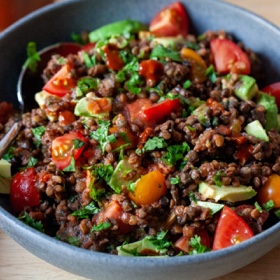

# [Lentil Salad](https://smittenkitchen.com/2022/01/my-favorite-lentil-salad/)
> **tags**: #Salad #To Try #0star

## Description

## Ingredients

- 2 1/2 cups cooked, cooled small green, brown, or black lentils [see Note at end]
- One 28-ounce can whole tomatoes
- 1/2 a large or 1 small white onion, chopped
- 1 to 2 fresh jalapeños, to taste, chopped
- 2 cloves garlic, chopped
- 1 cup chopped fresh cilantro leaves, divided
- 1 teaspoon kosher salt
- Freshly ground black pepper
- 1 lime, juiced, plus more to taste
- 1 large firm-ripe avocado, diced
- 2 cups (about a 12-ounce package) cherry tomatoes, halved or quartered
- Hot sauce, to taste
- Tortilla chips for serving (optional)

## Directions
Set a strainer set over a bowl to catch juices, and pour can of tomatoes into the strainer. If the tomatoes look full (i.e. whole and intact), press on them a bit to release more.

Place onion, jalapeño, and garlic in a blender or food processor [see Note at end] and run the machine in short bursts until they’re in smaller bits. Add two-thirds (just eyeball it) cilantro, drained tomatoes, salt, and juice of one lime and run the machine until the tomatoes are well-chopped but not totally smooth. When making salsa for scooping up with chips, I will add some of the reserved tomato juices, a tablespoon at a time, if the mixture is very thick, but to dress this lentil salad, we don’t want it very thin. Adjust seasoning to ensure it’s robust enough to dress the lentils, adding salt, pepper, and more lime juice, if needed to taste.

Place lentils in a big bowl. If they’re from a vacuum-pack, use your fingers to break up clumps. (I find a spoon or fork damages the lentils too much.) Add 1 1/2 cups of tomato mixture to the lentils and stir to combine. Taste and add more salsa to taste; I usually go with a full 2 cups. Season with salt and black pepper to taste, and add more lime juice if desired. Add avocado, tomatoes, and reserved cilantro and stir gently to combine. Serve with hot sauce and tortilla chips, if you wish.

Leftovers keep for 5 days in the fridge.

## Notes
Let’s talk about lentils: The best kind to use in salads are those that do not fall apart when cooked. My favorites are small green (often sold as lentils du Puy), small brown lentils (sometimes called castelluccio), or even black lentils. Cook them in salted water according to their package directions, or whatever your favorite way to cook lentils is, then cool them before using. Here I’m using one 17.6-ounce package of Trader Joe’s Steamed & Fully Cooked Lentils, a truly perfect product.

If you’re using an immersion or regular (i.e. not high-powered like a Vitamix) blender instead of a food processor to make the salsa, it helps to start with more finely chopped onion, garlic, and jalapeño. As written, roughly chopped is fine, presuming the machine will be mulching it further for us.

Deb, why are we making a full batch of your salsa when we will only use half? Because I want you to be able to add more to taste and because I’m thrilled to have extra — for tacos, for eggs, for chips. You could halve the tomatoes and other salsa ingredients, but I don’t want you to to come up short if you want more than it makes.

When making the salad with an eye towards leftovers for future lunches, I’ll often leave the avocado out so it doesn’t get soft or discolored in the fridge. [It’s still 100% okay to eat, but doesn’t look as cute.] Instead, I’ll add some each time I eat it.

## Data
**prep**  | **cook** 15 minutes | **total**  | **serves** Servings: 4 to 6