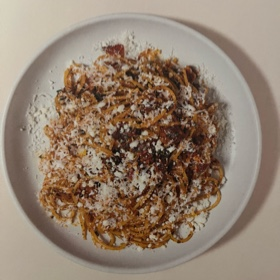

# Lula Spaghetti with Salsa Rosa
> **tags**: #Pasta #4star

## Description
Lula

## Ingredients

- Salsa Rossa
- 4 tablespoons blend oil
- 1/2 cup (4 oz/120 g) diced onion
- 1/2 cup (4 oz/120 g) diced Roasted
- Peppers (page 255)
- 1 teaspoon dried, toasted, and ground ancho pepper
- 1 teaspoon dried, toasted, and ground guajillo pepper
- To Serve
- 8 oz (225 g) spaghetti (we use
- Rustichella D'Abruzzo and Martelli)
- 2 tablespoons olive oil
- 1/4 cup (23/4 oz/70 g) 1/2-inch (1 cm) diced pancetta
- 14 cup (21/4 fl oz/65 g) Chicken Stock (page 254)
- 1 tablespoon + 1 teaspoon finely minced parsley
- 1 oz (25 g) cold butter, diced
- 1 oz (25 g) Parmesan, grated
- 1/4 cup (1 oz/25 g) crumbled queso fresco

## Directions
Put the blend oil and onions into a small saucepan and set over medium heat. Cook, stirring occasionally, until the mixture comes to a simmer. Reduce the heat to maintain a slow simmer, using a diffuser if necessary to maintain the temperature.

Cook until the onions have softened, about 30 minutes. Add the roasted and dried peppers and cook for an additional 30 minutes. Set aside.

TO SERVE

Bring a large pot of water to a boil over high heat. Salt generously. Add the pasta and cook until al dente, 1 minute less than the package instructions.

Meanwhile, set a large saute pan over low heat and add the oil and pancetta.

Gently cook until the fat is rendered and translucent and the pancetta is crisp at the edges. Add the salsa rossa, increase the heat to medium, and cook for 1 minute,

34

stirring and swirling the salsa in the pan.

Add the stock and cook for 1-2 minutes, until the sauce is reduced by half.

Drain the pasta, reserving at least

1 cup of pasta water, and add the pasta to the sauté pan off the heat. (I use tongs to pull the spaghetti from the pot and put it directly into the sauce without a thorough draining. This way the starchy, salty water is still coating the spaghetti and provides the sauce with some hydration.)

Return the sauté pan to medium heat, add the parsley, and toss the pasta several times to coat in the sauce. Taste for seasoning, and for the doneness of the pasta. If the pasta seems dry, which is likely, add 1 or 2 splashes of reserved pasta water. Once you love it, remove the pan from the heat and add the butter (see mantecare, page 176). Toss the pasta several more times to emulsify the butter into the sauce. Divide among 4 plates and top with Parmesan and queso fresco.

## Notes

## Data
**prep**  | **cook**  | **total**  | **serves** 