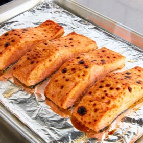

# [Maple-Mustard Broiled Salmon](https://www.seriouseats.com/maple-mustard-broiled-salmon-recipe-8662312)
> **tags**: #Fish #5star

## Description

## Ingredients

- 1/4 cup (60g) mayonnaise
- 2 tablespoons (30g) Dijon mustard
- 1 tablespoon (15g) maple syrup
- 1/4 teaspoon smoked paprika, chipotle powder, or cayenne (optional)
- Kosher salt and freshly ground black pepper
- 2 pounds salmon fillet (900g), with or without skin and either whole or divided into individual portions (see notes)

## Directions
Preheat broiler and set oven rack to about 6 inches below broiler element. Meanwhile, in a small bowl, whisk together mayonnaise, mustard, maple syrup, and smoked paprika, chipotle powder, or cayenne (if using). Season with salt and pepper; feel free to adjust flavor and heat level by adding more paprika, if desired.

Line a rimmed baking sheet with aluminum foil. Lightly season salmon all over with salt and pepper. Set salmon on prepared baking sheet and rub a thin, even layer of the maple-mustard mixture all over the surface and sides.

Broil salmon until browned on top and the center registers 115 to 125°F (46 to 52°C) for medium-rare to medium, respectively, about 5 minutes; it can help to keep the oven door cracked while salmon is cooking to prevent the broiler from cycling on and off (though not all ovens function this way). If salmon becomes well browned on top before it is cooked enough in the center, switch off the broiler and set the oven to 425°F (220°C), then continue cooking until done (this shouldn't take more than 1 to 2 minutes longer).

Transfer salmon to plates or a platter and serve.

## Notes

## Data
**prep** 10 mins | **cook** 5 mins | **total**  | **serves** 4 to 6