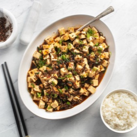

# [Mapo Tofu, Vegan](https://www.seriouseats.com/the-best-vegan-mapo-tofu-recipe)
> **tags**: #Asian #Vegan #Vegetarian #5star

## Description

## Ingredients

- 4 whole dried wood ear mushrooms (about 1/6 ounce)
- 1/4 ounce dried morel or porcini mushrooms, or a mix
- 1 (2-inch) piece of kombu (optional, see notes)
- 1 1/2 cups boiling water
- 6 ounces white button mushrooms, stems trimmed, quartered
- 1/3 cup vegetable oil
- 1 teaspoon cornstarch
- 2 tablespoons Shaoxing wine (see notes)
- 1 tablespoon dark soy sauce
- 2 tablespoons Sichuan peppercorns, 1 tablespoon left whole, the other toasted and ground in a spice grinder or mortar and pestle
- 2 whole dried Chinese hot chiles
- 3 garlic cloves grated on a microplane grater
- 1 tablespoon fresh ginger grated on a microplane grater
- 4 scallions, whites finely chopped, greens thinly sliced, reserved separately
- 12 Chinese chives or regular chives cut into 1/2-inch segments
- 3 tablespoons minced yacai (Chinese preserved mustard root, see notes, optional)
- 2 tablespoons fermented chili broad bean paste (see notes)
- 2 tablespoons roasted chili oil (see notes)
- 1 1/2 pounds medium to firm silken tofu, cut into 1/2-inch cubes

## Directions
Combine dried mushrooms and kombu (if using) in a small bowl or liquid measuring cup and cover with water. Place a paper towel or kitchen towel directly on surface of water to keep mushrooms mostly submerged. Set aside for 10 minutes to rehydrate.

Meanwhile, place button mushrooms in the bowl of a food processor and pulse until chopped into rough 1/4-inch pieces, about 6 to 8 one-second pulses. Combine chopped button mushrooms and oil in the bottom of a large wok. Heat over high heat, stirring constantly, until mushrooms are shriveled and well browned, 6 to 10 minutes. Strain through a fine mesh strainer set over a small saucepan. Transfer fried mushrooms to a medium bowl and return oil to wok.

When dried mushrooms are rehydrated, strain through a fine mesh strainer set over a small bowl. Discard kombu. Discard all but 3/4 cups soaking liquid. Add cornstarch, wine, and soy sauce to liquid. Transfer drained mushrooms to a cutting board. Remove and discard hard central stems from woodear mushrooms, then finely chop all the mushrooms. Add to bowl with fried mushrooms.

Add whole Sichuan peppercorns and both chiles to oil in wok and return to high heat. Cook until fragrant and peppercorns have stopped sputtering. Do not overcook, or they will burn. Immediately strain through a fine mesh strainer, discard peppercorns and chiles, and return oil to wok.

Heat oil over high heat until lightly smoking. Add garlic, ginger, scallion whites, chives, and yacai (if using). Stir-fry until fragrant, about 30 seconds. Add chopped mushrooms and stir-fry to combine. Add fermented chili broad bean paste and stir until all the vegetables are well coated. Stir mushroom liquid mixture to incorporate cornstarch, then add to wok. Cook, stirring constantly, until lightly thickened and reduced, about 1 1/2 minutes. Add tofu and carefully fold in, trying not to break it.

Cook until tofu is heated through. Transfer to a serving platter, drizzle with chili oil, and top with scallions and ground Sichuan peppercorns. Serve immediately with white rice.

## Notes

## Data
**prep** 10 mins | **cook** 20 mins | **total**  | **serves** 4 servings