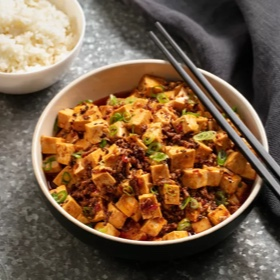

# [Mapo Tofu](https://www.seriouseats.com/real-deal-mapo-dofu-tofu-chinese-sichuan-recipe)
> **tags**: #Asian #0star

## Description

## Ingredients

- 2 tablespoons Sichuan peppercorns, divided (see notes)
- 1/4 cup vegetable oil
- 1 teaspoon cornstarch
- 2 teaspoons cold water
- 1 1/2 pounds medium to firm silken tofu, cut into 1/2-inch cubes
- 1/4 pound ground beef
- 3 garlic cloves grated on a microplane grater
- 1 tablespoon fresh ginger grated on a microplane grater
- 2 tablespoons fermented chili bean paste (see note)
- 2 tablespoons Xiaoxing wine
- 1 tablespoon dark soy sauce
- 1/4 cup low sodium chicken stock
- 1/4 cup roasted chili oil (see note)
- 1/4 cup finely sliced scallion greens

## Directions
Heat half of Sichuan peppercorns in a large wok over high heat until lightly smoking. Transfer to a mortar and pestle. Pound until finely ground and set aside.

Add remaining Sichuan peppercorns and vegetable oil to wok. Heat over medium high heat until lightly sizzling, about 1 1/2 minutes. Pick up peppercorns with a wire mesh skimmer and discard, leaving oil in pan.

Combine cornstarch and cold water in a small bowl and mix with a fork until homogenous. Bring a medium saucepan of water to a boil over high heat and add tofu. Cook for 1 minute. Drain in a colander, being careful not to break up the tofu.

Heat oil in wok over high heat until smoking. Add beef and cook, stirring constantly for 1 minute. Add garlic and ginger and cook until fragrant, about 15 seconds. Add chili bean paste, wine, soy sauce, and chicken stock and bring to a boil. Pour in cornstarch mixture and cook for 30 seconds until thickened. Add tofu and carefully fold in, being careful not to break it up too much. Stir in chili oil and half of scallions and simmer for 30 seconds longer. Transfer immediately to a serving bowl and sprinkle with remaining scallions and toasted ground Sichuan pepper. Serve immediately with white rice.

## Notes

## Data
**prep**  | **cook** 20 mins | **total**  | **serves** 4 servings