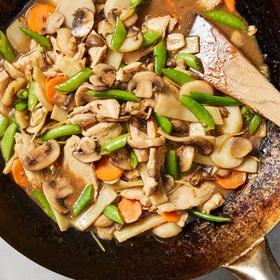

# [Moo Goo Gai Pan](https://cooking.nytimes.com/recipes/1024751-moo-goo-gai-pan)
> **tags**: #Stir Fry #5star

## Description

## Ingredients

- 1 pound boneless, skinless chicken breasts
- 3 tablespoons oyster sauce
- 5 tablespoons neutral oil, plus more as needed
- 2 tablespoons cornstarch
- 1 cup low-sodium chicken broth
- 1 tablespoon low-sodium soy sauce
- 1 teaspoon granulated sugar
- 1 teaspoon toasted sesame oil
- 1/4 teaspoon ground white pepper (optional)
- 1 medium carrot, peeled and thinly sliced into coins
- 1 (2-inch) piece ginger, peeled and thinly sliced into matchsticks
- 12 ounces white button or shiitake mushrooms, or a mix, stemmed and sliced
- 4 ounces sugar snap peas, trimmed and halved crosswise
- 1 (8-ounce) can sliced bamboo shoots, drained
- 1 (8-ounce) can sliced water chestnuts, drained
- 2 tablespoons Shaoxing wine, or dry Sherry
- Steamed white rice, for serving

## Directions
Pat the chicken dry with paper towels, then cut crosswise into 1/4-inch-thick slices. Place in a medium bowl and add 1 tablespoon oyster sauce, 1 tablespoon oil and 1 tablespoon water. Toss, sprinkle on 1 tablespoon cornstarch and toss again until each piece of chicken is fully coated. Let marinate for at least 10 minutes or up to 2 hours; refrigerate if marinating longer than 30 minutes, but bring to room temperature 15 minutes before cooking. 

In a medium bowl, whisk 3/4 cup chicken broth, soy sauce, sugar, sesame oil, white pepper (if using), the remaining 2 tablespoons oyster sauce and the remaining 1 tablespoon cornstarch until combined. Set aside.

Heat 2 tablespoons of the oil in a wok or large (12-inch) cast-iron or nonstick skillet over medium-high. Once the oil starts shimmering, add the marinated chicken in an even layer, cooking in batches and adding more oil, if necessary. Cook until the edges of the chicken are slightly golden brown and the meat no longer sticks to the pan, 1 to 2 minutes. Flip the chicken and cook until golden, about 1 minute more. Transfer to a plate. 

Add the remaining 2 tablespoons of the oil, carrot and ginger to the wok. Cook, stirring occasionally, until ginger is golden brown, about 30 seconds. Stir in the mushrooms. Add the remaining 1/4 cup chicken broth and toss until everything is well combined. Bring to a simmer, and cook until reduced by half. (This happens very quickly, about 30 seconds.) Add chicken and any reserved juices, sugar snap peas, bamboo shoots and water chestnuts, tossing until combined. Increase heat to high. Add Shaoxing wine and scrape up any brown bits from the bottom of the pan.

Reduce heat to medium. Whisk the reserved chicken broth mixture once more and add to the wok. Stir until everything is well combined, the sauce is slightly thickened and the chicken is fully cooked, 2 to 3 minutes. Transfer to a platter and serve alongside steamed white rice.

## Notes

## Data
**prep** 15 min | **cook** 30 min | **total** 45 min | **serves** 4 servings