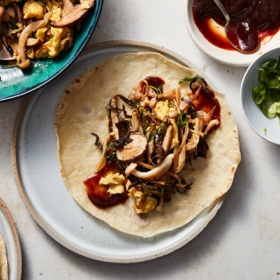

# [Moo Shu Mushrooms](https://cooking.nytimes.com/recipes/1020817-moo-shu-mushrooms)
> **tags**: # #0star

## Description

## Ingredients

- 1/3 cup dried Chinese wood ear mushrooms (about 10 grams)
- 1/4 packed cup dried day lily buds (about 15 grams)
- 1 tablespoon Shaoxing wine or dry sherry
- 1 tablespoon light soy sauce or shoyu
- 1 teaspoon cornstarch
- 1/2 teaspoon white pepper, plus more as needed
- Kosher salt
- 2 ounces pork loin, pork sirloin, chicken breast or extra-firm tofu, cut into 1 1/2- to 2-inch slivers
- 4 tablespoons roasted sesame oil
- 3 eggs, thoroughly beaten with a pinch of salt
- 2 slices fresh ginger
- 1/2 pound mixed sliced fresh mushrooms, preferably Asian mushrooms such as shimeji, shiitake, enoki, oyster or maitake
- 2 scallions, thinly sliced on a sharp bias
- 1/4 teaspoon MSG (optional)
- Mandarin pancakes or warm flour tortillas
- Hoisin sauce or sweet bean sauce

## Directions
Rehydrate the dried ingredients for the filling: Place wood ear mushrooms and day lily buds in two separate medium bowls or measuring cups large enough to allow for them to expand about fourfold. Cover with very hot water, and set aside until rehydrated, about 15 minutes. (I use hot tap water, but you could also use water heated on the stovetop or in the microwave.) Drain thoroughly. Remove tough centers from the wood ears, then thinly slice them. Cut day lilies into 2-inch pieces.

While wood ears and day lilies rehydrate, prepare the pork marinade: Combine 1/2 teaspoon Shaoxing wine, 1/2 teaspoon soy sauce, 1/2 teaspoon cornstarch, 1/4 teaspoon white pepper and a pinch of kosher salt in a medium bowl, and whisk with a fork to combine. Add pork and stir roughly with fingertips or chopsticks until thoroughly combined, then continue stirring for 10 seconds. Set aside for 15 minutes at room temperature.

Meanwhile, make the sauce: Combine remaining 2 1/2 teaspoons Shaoxing wine, 2 1/2 teaspoons soy sauce, 1/2 teaspoon cornstarch and 1/4 teaspoon white pepper in a small bowl and whisk with a fork until no lumps remain.

Cook the eggs: Heat wok over high until lightly smoking. Add 2 tablespoons oil and swirl to coat. Pour the beaten eggs into the center and cook without moving for 10 seconds. Continue to cook, breaking up the eggs with a spatula until they are barely set, 30 to 45 seconds. Transfer eggs to a large bowl.

Wipe out wok and return to high heat until lightly smoking. Add 1 tablespoon sesame oil and swirl to coat. Add 1 ginger slice and let sizzle for 5 seconds. Immediately add pork and stir-fry until pork is no longer pink and mostly cooked through, about 1 minute. Discard ginger slice, then transfer pork to bowl with eggs.

Wipe out wok and return to high heat until lightly smoking. Add remaining 1 tablespoon oil and swirl to coat. Add remaining ginger slice and let sizzle for 5 seconds. Immediately add the fresh mushrooms and stir-fry until mushrooms are lightly browned around the edges, 2 to 3 minutes. Add scallions, sliced wood ears and day lilies, and stir-fry until softened and fragrant, about 30 seconds.

Add the pork and eggs back to the wok. Stir sauce to combine again, then add it to the wok along with the MSG, if using. Stir-fry everything to combine and season to taste with salt and more white pepper, if desired. Discard ginger. Transfer moo shu mixture to a serving platter and serve immediately with Mandarin pancakes and hoisin sauce.

## Notes

## Data
**prep**  | **cook**  | **total** 45 min | **serves** 4 servings