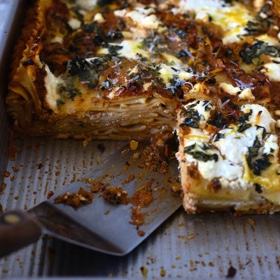

# [Mushroom Lasagna](https://www.101cookbooks.com/mushroom-lasagna/)
> **tags**: #Pasta #4star

## Description

## Ingredients

- extra-virgin olive oil or butter, for pan and drizzling
- zest of one lemon (or orange)
- 2 pounds of homemade pasta dough or 1 pound dried lasagna sheets (see head notes)
- 6 cups mushroom ragù
- 3 cups ricotta cheese
- 8 basil leaves
- freshly grated Parmesan cheese

## Directions
Preheat Oven to 400F, rack in the center.

Oil or butter your 13x9-inch baking pan generously. Sprinkle with half of the lemon zest and set aside.

Pre-cook the lasagna sheets:

Bring a large pot of water to a boil. In the meantime, to prepare, fill a large bowl with ice cold water and a few glugs of olive oil. Get a large, rimmed baking sheet and add a bit of olive oil to that as well. Now you are ready to boil your pasta. Place a handful of the pasta rectangles into the boiling water to cook (I've found I can get away with about 20 at a time), fish them out (I use a spider) after just 15-20 seconds, don't over cook. Transfer the pasta immediately to the cold olive-oil water for a quick swim and cool-off. Remove from the cold water bath and the sheets out on the oiled baking sheet. It is ok for them to overlap, as long as they’re coated with a bit of oil they shouldn’t stick. (If using store-bought lasagna sheets, cook for about 6 minutes, or follow package instructions.) Repeat until all your pasta is boiled.

Build the lasagna:

Spread the baking pan with a layer of mushroom ragu and cover with a layer of pasta. Add another layer of ragu, and some dollops of ricotta. Repeat the layering until you have used all of the ingredients — usually 3 or four layers. Be sure to finish with a generous layer of the ragu, ricotta, basil (chopped or whole leaves), and grated Parmesan cheese. Sprinkle with the remaining lemon zest and drizzle with a bit of olive oil.

Bake the lasagna:

Bake, uncovered, until the lasagna is crisp-edged, golden and a little bubbly at the edges - 35-40 minutes. Remove from the oven and allow it to rest for a few minutes before slicing. Serve topped with more Parmesan and a drizzle of good olive oil.

## Notes

## Data
**prep** 1 hr | **cook** 40 mins | **total**  | **serves** Serves 8-10