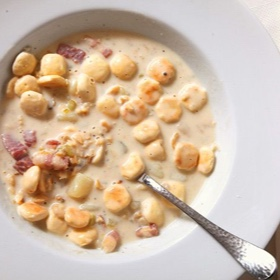

# [New England Clam Chowder](https://www.seriouseats.com/new-england-clam-chowder-recipe)
> **tags**: #Soup #To Try #0star

## Description

## Ingredients

- 1/2 pound salt pork or bacon, cut into 1/2-inch cubes
- 2 tablespoons butter
- 1 medium onion, finely chopped (about 1 cup)
- 2 stalks celery, finely chopped (about 1 cup)
- 1 cup water or clam juice
- 2 1/2 pounds live cherrystone or littleneck clams (see notes)
- 1 quart whole milk
- 1 1/2 pounds russet or Yukon Gold potatoes, peeled and cut into 1/2-inch cubes
- 2 bay leaves
- Kosher salt and freshly ground black pepper
- 1 cup heavy cream
- Oyster crackers, for serving

## Directions
Combine salt pork and 1/4 cup water in a heavy-bottomed stock pot or Dutch oven over medium heat, stirring occasionally, until water has evaporated and pork has begun to brown and crisp in spots, about 8 minutes.

Add butter, onion, and celery. Continue to cook, stirring occasionally, until onions are softened but not browned, about 4 minutes longer. Add clam juice or water and stir to combine.

Add clams or quohogs and increase heat to high. Cover and cook, opening lid to stir occasionally, until clams begin to open, about 3 minutes. As clams open, remove them with tongs and transfer to a large bowl, keeping as many juices in the pot as possible and keeping the lid shut as much as possible. After 8 minutes, discard any clams that have not yet begun to open.

Add milk, potatoes, bay leaves, and a pinch of salt and pepper to the pot. Bring to a boil, reduce to a bare simmer, and cook, stirring occasionally, until potatoes are tender and starting to break down, about 15 minutes.

Meanwhile, remove meat from inside the clams and roughly chop it. Discard empty shells. Transfer chopped clams and as much juice as possible to a fine-mesh strainer set over a large bowl. Let clams drain, then transfer chopped clams to a separate bowl. Set both bowls aside.

Once potatoes are tender, pour the entire mixture through the fine-mesh strainer into the bowl with the clam juice rapping the strainer with the back of a knife or a honing steel to get the liquids to pass through. Transfer strained solids to the bowl with the chopped clams. You should end up with a white, semi-broken broth in the bowl underneath, and the chopped clams, potatoes, salt pork, and aromatics in the separate bowl.

Transfer liquid to a blender and blend on high speed until smooth and emulsified, about 2 minutes. Return liquid and solids back to Dutch oven. Add heavy cream and stir to combine. Reheat until simmering. Season well with salt and pepper. Serve immediately with oyster crackers.

## Notes

## Data
**prep** 5 mins | **cook** 45 mins | **total**  | **serves** 4 to 6 servings