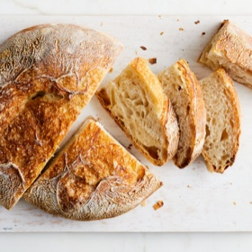

# [No-Knead Bread, Updated](https://cooking.nytimes.com/recipes/1022147-updated-no-knead-bread)
> **tags**: #Bread #0star

## Description

## Ingredients

- 400 grams bread flour (about 2 2/3 level cups; see Tip)
- 8 grams salt
- 2 grams instant or “rapid rise” yeast (about 1/2 teaspoon; see Tip)
- 280 grams warm water (about 1 cup plus 3 tablespoons; see Tip)
- 1/8 teaspoon white vinegar or lemon juice
- Rice flour or extra bread flour, for dusting

## Directions
Mix the dough: Combine the flour, salt and yeast in a large bowl and mix with your hands until mostly homogenous. Combine the water and vinegar or lemon juice, then add to the bowl. Form one hand into a stiff claw, and stir with it until no dry flour remains and the dough forms a sticky, shaggy ball. Roll the ball around the bowl until most of the dough is part of the same large mass. The mixing process should take no more than 30 to 45 seconds.

Scrape your dough-covered hand with your clean hand or with a metal or plastic dough scraper to get most of the dough into the bowl, then invert a tall-sided medium metal or glass bowl (or a cutting board) and place it on top of the large bowl, tapping it to ensure a tight seal. Let dough rest at least 12 hours and up to 18 hours at room temperature, 60 to 70 degrees. When the dough is done resting, it should appear very bubbly and wet.

Shape the loaf: Wipe out any moisture collected inside the medium bowl. Dust a dish towel thoroughly on one side with rice flour or bread flour, then line the medium bowl with the towel, floured-side up. Generously flour your work surface. Sprinkle flour around the edges of the dough in the large bowl, then tilt the bowl over your floured work surface, using your fingertips to ease the dough away from the bowl until it all tips out. (Some bits of the dough will stick to the bowl, this is OK; leave them behind.)

Working gently but quickly to avoid deflating the dough, using one hand, reach under one side with your fingertips, stretch the dough, and fold it over itself into the center. Repeat three more times until each side of the dough has been folded over the top. Using the sides of your hands instead of your fingertips and as much extra flour as necessary to prevent sticking, flip the dough over. With your palms up and hands placed flat on the work surface, gently tuck the dough together underneath until the top surface is relatively smooth and taut.

Proof the loaf: Carefully lift the dough, place it smooth-side up into the towel-lined bowl, and dust lightly with rice flour or bread flour. Cover the bowl with a large baking sheet and allow the dough ball to rise until it roughly doubles in volume and doesn’t spring back readily when you poke it with a fingertip, about 2 hours. Meanwhile, wash out the large bowl and have it ready.

Heat the oven: At least 30 minutes before baking, adjust oven rack to lower-middle position and heat oven to 500 degrees. When dough is ready, invert the bowl and baking sheet so that the dough is lying on the sheet. (The sheet will end up inverted.) Lift off the bowl and carefully lift off the kitchen towel. If it sticks at all, be very gentle when coaxing the dough off; the goal is to minimize the loss of gases trapped inside.

Bake the bread: Splash some water inside the larger metal bowl, then invert it onto the baking sheet over the dough. Transfer the whole thing to the oven, reduce oven temperature to 450 degrees, and bake for 25 minutes. Using oven mitts or dry kitchen towels, remove the bowl and continue baking until the loaf is as dark as you’d like it, 15 to 25 minutes longer. Remove the bread, transfer to a cooling rack, and allow to cool completely before cutting it open.

## Notes
It is strongly recommended to use a gram scale for accuracy and success in this recipe. This recipe calls for bread flour, ideally King Arthur brand flour, which has a protein content of 12.7 percent. If using all-purpose flour, decrease water content by 20 grams. If using active dry yeast instead of instant or rapid rise, increase the amount to 2.25 grams (a heaping ½ teaspoon). The water should feel warm to the touch and register around 90 degrees on an instant-read thermometer.

To make a rye or whole-wheat version of this bread, substitute 100 grams of the bread flour with an equal quantity of rye or whole-wheat flour, and increase the water by 10 grams.

## Data
**prep**  | **cook** 21 hr | **total** 21 hr | **serves** 1 loaf