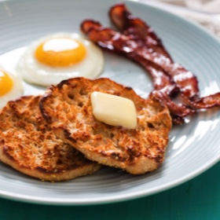

# [No-Knead English Muffins](https://www.seriouseats.com/no-knead-english-muffins-recipe)
> **tags**: #Quick Bread #0star

## Description

## Ingredients

- 10 ounces bread flour (2 cups; 285g)
- 5 ounces whole wheat flour (1 cup; 140g) (see note)
- 2 3/4 teaspoons (11g) Diamond Crystal kosher salt; for table salt, use the same weight or half as much by volume
- 1 1/4 teaspoons (4g) instant dry yeast (not rapid-rise)
- 12 ounces cold milk (1 1/2 cups; 340g), any percentage will do (see note)
- 3 1/2 ounces honey (1/4 cup; 100g)
- 1 large egg white, cold
- 5 ounces fine cornmeal (1 cup; 145g), for dusting
- Roughly 1 ounce bacon fat, unsalted butter, or oil (2 tablespoons; 30g), for griddling

## Directions
Make the Dough and Let Rise: In a large bowl, mix bread flour, whole wheat flour, kosher salt, and yeast together until well combined. Add milk, honey, and egg white, stirring with a flexible spatula until smooth, about 5 minutes. Cover with plastic and set aside until spongy, light, and more than doubled, 4 to 5 hours at 70°F (21°C). (The timing is flexible depending on your schedule.)

For the Second Rise: Thickly cover a rimmed aluminum baking sheet with an even layer of cornmeal. With a large spoon, dollop out twelve 2 2/3–ounce (75g) portions of dough; it's perfectly fine to do this by eye. If you'd like, pinch the irregular blobs here and there to tidy their shape. Sprinkle with additional cornmeal, cover with plastic, and refrigerate at least 12 and up to 42 hours.

To Griddle and Serve: Preheat an electric griddle to 325°F (160°C) or warm a 12-inch cast iron skillet or griddle over medium-low heat. When it's sizzling-hot, add half the butter and melt; griddle muffins until their bottoms are golden brown, about 8 minutes. Flip with a square-end spatula and griddle as before. Transfer to a wire rack until cool enough to handle, then split the muffins by working your thumbs around the edges to pull them open a little at a time. Toast before serving and store leftovers in an airtight container up to 1 week at room temperature (or 1 month in the fridge).

## Notes

## Data
**prep** 10 mins | **cook** 20 mins | **total**  | **serves** 12 muffins