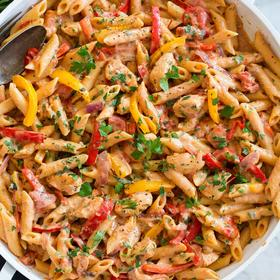

# [One Pot Cajun Chicken Pasta](https://www.cookingclassy.com/one-pot-cajun-chicken-pasta/)
> **tags**: #Chicken #Mains #Pasta #5star

## Description

## Ingredients

- 1 1/2 Tbsp olive oil, divided
- 1 lb boneless skinless chicken breasts, cut into 1-inch pieces
- 1 1/2 Tbsp cajun seasoning, recipe HERE
- 1 medium red bell pepper, sliced into strips, about 2-inches long
- 1 medium yellow bell pepper, sliced into strips, about 2-inches long
- 1 small (5 - 6 oz) red onion, halved and thinly sliced
- 2 garlic cloves, minced (2 tsp)
- 2 (14.5 oz) cans low-sodium chicken broth
- 1 (14.5 oz) can fire roasted diced tomatoes
- 3/4 cup heavy cream, divided
- 12 oz. penne pasta (recommend Barilla for consistency)
- 2 tsp cornstarch, mixed with 1 Tbsp water
- 3/4 cup finely shredded parmesan cheese
- 3 Tbsp minced fresh parsley
- Salt and freshly ground black pepper, to taste

## Directions
Heat 1 Tbsp olive oil in a large pot over medium-high heat.

Toss chicken with 1/2 Tbsp cajun seasoning. Add to pot in a single layer.

Cook until browned on bottom, about 3 minutes then turn and continue to cook through, about 3 minutes longer. Transfer to a sheet of foil and wrap to keep warm.

Heat remaining 1/2 Tbsp olive oil in same pot over medium-high heat. Add bell peppers and onion and saute 3 minutes. Add garlic and remaining 1 Tbsp cajun seasoning and saute 1 minute longer.

Pour in chicken broth, tomatoes, and 1/2 cup heavy cream. Bring mixture to a boil, then add pasta.

Cook, stirring frequently until pasta is nearly tender, about 12 - 13 minutes. Add cornstarch and water mixture and cook until pasta is just tender and sauce mixture has thickened, about 1 minute longer.

Remove from heat. Toss in remaining 1/4 cup cream, parmesan, parsley and cooked chicken, and season with salt and pepper to taste. Serve warm.

## Notes

## Data
**prep** 20 minutes | **cook** 20 minutes | **total**  | **serves** Servings: 6