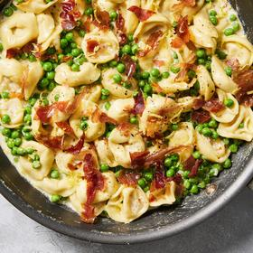

# [One-Pot Tortellini with Prosciutto and Peas](https://cooking.nytimes.com/recipes/1025271-one-pot-tortellini-with-prosciutto-and-peas)
> **tags**: # #0star

## Description

## Ingredients

- 1 1/2 tablespoons unsalted butter, plus more if needed
- 4 slices prosciutto (about 2 ounces)
- 1 shallot, finely chopped
- 16 to 20 ounces refrigerated cheese tortellini
- 2 cups (10 ounces) frozen peas (no need to thaw)
- 1 cup chicken broth
- 1 cup heavy cream
- 1/4 teaspoon ground nutmeg (optional)
- Salt and black pepper
- Zest and juice of 1/2 lemon (about 1 1/2 teaspoons zest plus 1 1/2 tablespoons juice)

## Directions
In a large nonstick skillet, melt the butter over medium. Add the prosciutto in a single layer and cook, flipping halfway through, until golden and crisp, 2 to 4 minutes. Press occasionally with a spatula to ensure even crisping and reducing the heat as necessary if the fat begins to smoke. Transfer the prosciutto to a plate, leaving the fat in the pan.

To the skillet, add the shallot and cook over medium until softened, 2 to 4 minutes, adding about ½ tablespoon butter if the pan is dry. Add the tortellini, peas, chicken broth, heavy cream and nutmeg (if using) and season with salt and pepper. Simmer over medium-high, stirring occasionally, until the pasta and peas are tender, 3 to 5 minutes. (The sauce will thicken as it cools.) Turn off the heat and stir in the lemon zest and juice. Season to taste with salt and pepper. Crumble the prosciutto on top.

## Notes

## Data
**prep** 5 min | **cook** 20 min | **total** 25 min | **serves** 4 servings