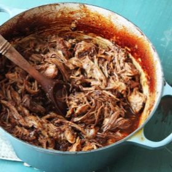

# [Oven-Cooked Pulled Pork](https://www.seriouseats.com/easy-oven-pulled-pork-recipe)
> **tags**: #Mains #0star

## Description

## Ingredients

- 5 tablespoons dark brown sugar (2 1/4 ounces; 65g)
- 1 tablespoon (about 9g) Diamond Crystal kosher salt; for table salt use half as much by volume or the same weight
- 1 tablespoon paprika
- 1 teaspoon ground cumin
- 1 teaspoon freshly ground black pepper
- 1 teaspoon ground coriander
- 1/2 teaspoon ground fennel seed
- Large pinch cayenne pepper
- 1 whole bone-in or boneless pork butt (5 to 7 pounds; 2.25 to 3kg)
- 1 cup ketchup (8 ounces; about 225g)
- 1/2 cup dark molasses (4 ounces; about 115g)
- 1/2 cup (120ml) cider vinegar, divided
- 2 tablespoons (30ml) Worcestershire sauce
- 1 tablespoon (15ml) high-quality liquid smoke, such as Wright's (see Note)
- 1 tablespoon (15ml) brown mustard
- 2 teaspoons (10ml) hot sauce
- 1 tablespoon (15ml) vegetable oil
- 1 large onion, finely minced (about 6 ounces; 170g)
- 1 cup (240ml) bourbon
- 1/2 cup (120ml) homemade or store-bought low-sodium chicken stock or water

## Directions
Adjust oven rack to lower position and preheat oven to 300°F (150°C). Combine sugar, salt, paprika, cumin, black pepper, coriander, ground fennel seed, and cayenne pepper in a small bowl and mix. Season pork with 2 to 3 tablespoons spice mixture, making sure to rub it on all sides. Reserve remaining spice mixture.

Whisk together ketchup, molasses, half of cider vinegar, Worcestershire sauce, liquid smoke, mustard, and hot sauce in a medium bowl. Whisk in remaining spice mixture. Set aside.

Heat oil in a Dutch oven over medium-high heat until shimmering. Add pork and cook, turning occasionally, until well browned on all sides, about 5 minutes total. (Pork will brown fast because of the sugar. Do not let it burn.) Add onion and cook, stirring and scraping up browned bits from the bottom of the pan, until softened, about 2 minutes.

Turn off burner and add bourbon. Relight burner. Carefully ignite the bourbon with a long match or lighter. (Stand back and make sure there is nothing flammable above it; it will produce tall flames.) Let cook until flames die out, about 2 minutes.

Make sure pork is oriented fat side up. Add half of sauce and chicken stock or water. Cover Dutch oven, transfer to oven, and cook until pork is just starting to turn tender, about 4 hours. Remove lid and continue cooking until a knife or fork shows very little resistance when twisted inside the meat and a dark bark has formed, about 1 hour longer.

Transfer pork to a large bowl, reserving liquid in pot. Using a ladle, skim off excess fat and discard. Add reserved sauce and remaining vinegar to pot and whisk to combine. When pork is cool enough to handle, shred with two forks.

Transfer shredded pork to pot and toss with sauce. (If making ahead to serve over the course of several meals, store pork and sauce separately, adding sauce only to the portion you are serving immediately.) Season to taste with more salt, sugar, liquid smoke, or cider vinegar. Serve.

## Notes

## Data
**prep** 15 mins | **cook** 5 hrs 15 mins | **total**  | **serves** 8 to 12 servings