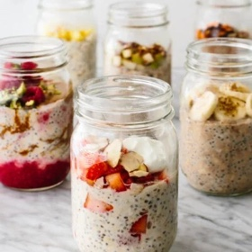

# [Overnight Oats](https://downshiftology.com/recipes/overnight-oats/)
> **tags**: #Breakfast #5star

## Description

## Ingredients

- BASIC OVERNIGHT OATS
- 1/2 cup rolled oats
- 1/2 cup milk (dairy or dairy-free)
- 1/4 cup Greek yogurt (dairy or dairy-free)
- 1 tablespoon chia seeds
- 1 tablespoon maple syrup
- BANANA BREAD OVERNIGHT OATS
- 1/2 banana, mashed
- 2 tablespoon chopped walnuts
- 1/2 teaspoon vanilla extract
- 1/2 teaspoon cinnamon
- pinch of ground flaxseed
- SPICED PEAR OVERNIGHT OATS
- 1/2 pear, diced
- 1 tablespoon chopped pecans
- 1/2 teaspoon cinnamon
- pinch of nutmeg
- PB&J OVERNIGHT OATS
- 2 tablespoon raspberry jam or puree
- 1 tablespoon peanut butter (or almond butter)
- 1 teaspoon chopped pistachios
- PINA COLADA OVERNIGHT OATS
- 1/4 cup small diced pineapple
- 1 tablespoon shredded coconut
- 1/4 teaspoon vanilla extract
- CARROT CAKE OVERNIGHT OATS
- 1/4 cup shredded carrot
- 1 tablespoon shredded coconut
- 1 tablespoon raisins
- 1/2 teaspoon vanilla extract
- 1/2 teaspoon cinnamon
- STRAWBERRY PROTEIN OVERNIGHT OATS
- 1/4 cup small diced strawberry
- 1 scoop protein powder or collagen powder
- 1 tablespoon sliced almonds
- 1/2 teaspoon vanilla extract

## Directions
Add all the ingredients into a sealable jar or bowl and give it a stir until combined.

Let it soak in the fridge for at least 2 hours, but it's best to soak overnight for 8 hours. This will yield a creamier consistency.

Top your overnight oats with your favorite toppings and enjoy!

LISA’S TIPS

If you make a large batch in a bowl, once it’s set and thickened overnight scoop out about 1 cup for a single serving.

## Notes
*note: use coconut milk in the base recipe

## Data
**prep** 5 mins | **cook** 8 hrs 5 mins | **total**  | **serves** Servings: 1 serving