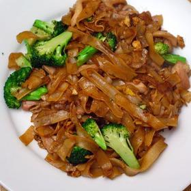

# [Pad See-Ew](https://www.seriouseats.com/pad-see-ew-thai-recipe)
> **tags**: #Asian #5star

## Description

## Ingredients

- 4 ounces boneless chicken, thinly sliced
- 1 teaspoon baking soda
- 2 tablespoons oyster sauce
- 4 teaspoons light soy sauce, divided
- 2 teaspoons sugar
- 2 teaspoons rice vinegar
- 1 garlic clove, minced
- Vegetable oil
- 8 ounces flat rice noodles
- 1 1/2 cups broccoli florets, sliced
- 2 large eggs
- 2 tablespoons sweet dark soy sauce

## Directions
In a medium-sized bowl, toss the chicken with 2 teaspoons of soy sauce and the baking soda. Set aside.

In a second medium-sized bowl, whisk together the oyster sauce, 2 teaspoons soy sauce, sugar, rice vinegar, and garlic clove.

Bring a large pot of water to a boil. Add the rice noodles and cook according to the directions on the packaging. When done, remove noodles with a pair of tongs and drain in a colander. Toss with a tablespoon of oil so the noodles don't stick together.

Place the pot back over high heat and return to a boil. Place the marinated chicken in a large strainer and dip into the water. Cook until the chicken looks white. When done set the chicken aside in a large bowl.

Pour enough oil into a large work to just coat the bottom and turn heat to high. When just starting to smoke, add the broccoli. Stir-fry until broccoli turns bright green and becomes tender. Transfer broccoli to the large bowl and set aside.

Carefully rinse out the wok and then dry it. Pour in two tablespoons of oil, and turn heat to high. When just starting to smoke, crack in the eggs. Using a wooden spoon, scramble the eggs. When set, add the noodles. Toss well to separate the strands, and then let them cook for a minute.

Drizzle on the sweet soy sauce, toss well, and then let cook undisturbed until the noodles start to brown, about one minute. Add the broccoli and chicken back to the pan. Toss well. When everything is warm, pour in sauce. Stir fry until everything is coated. Turn off the heat and serve immediately.

## Notes

## Data
**prep** 5 mins | **cook** 40 mins | **total**  | **serves** 4 servings