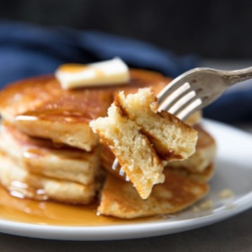

# [Pancakes, Stellas](https://www.seriouseats.com/thick-and-fluffy-pancakes)
> **tags**: #Breakfast #Charlie #5star

## Description

## Ingredients

### For the Pancake Mix
- 4 1/2 ounces all-purpose flour, such as Gold Medal blue label (about 1 cup, spooned; 125g)
- 1/2 ounce sugar (about 1 tablespoon; 15g)
- 1/2 ounce malted milk powder, such as Carnation or Hoosier Hill Farms (about 2 tablespoons; 15g)
- 1 1/2 teaspoons (6.8g) baking powder
- 1/2 teaspoon (2g) Diamond Crystal kosher salt; for table salt, use about half as much by volume or the same weight
- 1/4 teaspoon (1.6g) baking soda
- 2 1/2 ounces refined coconut oil, solid and firm, between 68°F and 72°F (about 1/3 cup; 70g), see note

### For the Pancakes
- 4 ounces milk, any percentage will do, or non-dairy alternatives (about 1/2 cup; 115g)
- 1 large egg, straight from the fridge (1 3/4 ounces; 50g)
- 1/4 ounce vanilla extract (about 1 1/2 teaspoons; 7g)
- 1 batch pancake mix, above (about 1 1/2 cups; 8 1/4 ounces; 233g)

## Directions
For the Pancake Mix: In the bowl of a food processor, combine flour, sugar, malted milk powder, baking powder, salt, and baking soda. Process about 30 seconds to ensure the leavening agents are fully homogenized into flour.

Add solid coconut oil and pulse only until it disappears into a dry and powdery mix, just a few seconds. It's important that the coconut oil is fully combined into the flour, while also remaining powdery and dry, so use caution and avoid over-processing, especially with larger batches. At this point, you can either continue with the recipe or transfer the mix to an airtight container and store up to one year at or below 74°F (24°C), or until the date stamped on the package of coconut oil.

For the Pancakes: Preheat an electric griddle to 350°F (177°C), or heat a large, nonstick skillet to a similar temperature on the stovetop. In a large mixing bowl, whisk milk, egg, and vanilla extract until well combined. Add the prepared pancake mix, and whisk until relatively smooth, although a few flecks of coconut oil may dot the batter.

With a large scoop, measuring cup, or piping bag, divide batter in 1/3-cup portions (or as desired), and griddle until golden brown on either side, and cooked through the middle, about 90 seconds per side. Serve immediately, with butter, maple syrup, fresh fruit, whipped cream, or whatever other toppings sound fun.

Troubleshooting: The timing and yield of this recipe will vary substantially depending on how the pancake batter is portioned as well as the exact temperature of the griddle itself. When pancakes are excessively browned but raw in the middle, the griddle is likely too hot; when the pancakes are cooked through but too soft and pale, the griddle may be too cool.

In an airtight container, the pancake mix can be stored up to one year at or below 74°F (24°C), or until the date stamped on the package of coconut oil.

## Notes
This mix can be prepared with an equal amount of cold, unsalted butter to replace the coconut oil; however, this will eliminate its make-ahead qualities, and the mix will need to be prepared and used right away.

## Data
**prep**  | **cook** 10 mins | **total**  | **serves** 8 servings