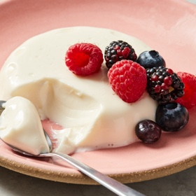

# [Panna Cotta](https://cooking.nytimes.com/recipes/1024352-panna-cotta)
> **tags**: #Dessert #0star

## Description

## Ingredients

- Neutral oil or nonstick cooking spray, for the ramekins
- 1 cup/240 milliliters whole milk
- 2 1/2 teaspoons powdered unflavored gelatin (1 pouch)
- 1/2 cup/100 grams granulated sugar
- 1 teaspoon vanilla extract
- 1/8 teaspoon salt
- 2 cups/480 milliliters heavy cream

## Directions
Lightly brush six (6-ounce) ramekins, water glasses or molds with neutral oil, wiping away any excess with a paper towel.

Pour the milk into a medium saucepan. Sprinkle the gelatin onto the milk in an even layer and set aside for 5 minutes for the gelatin to “bloom.” The surface of the milk will turn dry and wrinkly.

Turn the heat to low and cook, stirring often, until the gelatin is dissolved, about 2 minutes. Add the sugar, turn off the heat and stir until the sugar is dissolved, returning the pan to low heat to rewarm if needed. Stir in the vanilla and salt.

Pour the milk mixture through a sieve into a large glass measuring cup or other heat-proof container with a pouring spout. Add the cream and stir to combine. Divide the mixture among the prepared ramekins, cover with plastic wrap, and refrigerate until set, at least 4 hours. 

Serve the panna cottas directly from the ramekins, or unmold if desired. To unmold: Just before serving, add 1 inch of hot tap water to a small bowl. Place one of the ramekins in the bowl, being careful that the water doesn’t overflow into the ramekin, and hold it there for 10 seconds. Remove the ramekin and dry the bottom with a dish towel. Run a sharp knife around the sides of the panna cotta, then place an upside-down dessert plate over the ramekin. Holding the two together, flip the plate so that the ramekin is inverted. Wiggle and tap the sides of the ramekin to release the panna cotta. If it does not release, return the ramekin to the water for another 5 seconds.

Repeat with the remaining ramekins, refilling the small bowl with more hot water as necessary. Top the panna cottas with fruit or other desired toppings and serve.

## Notes

## Data
**prep** 5 min | **cook** 15 min | **total** 15 min | **serves** 6 servings