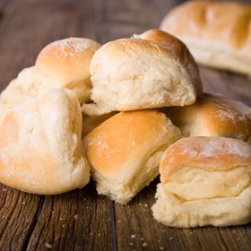

# [Parker House Rolls](https://www.jamesbeard.org/recipes/parker-house-rolls)
> **tags**: #Quick Bread #0star

## Description

## Ingredients

- 2 packages active dry yeast
- 1 tablespoon granulated sugar
- 1/2 cup warm water (100ºF to 115ºF, approximately)
- 1/2 stick (1/4 cup) butter, cut into small pieces
- 2 cups warm milk
- 5 to 6 cups all-purpose flour
- 2 teaspoons salt
- 1/4 cup to 1/2 cup melted butter
- 1 egg, beaten with 2 tablespoons light cream or milk

## Directions
Dissolve the yeast and the sugar in the warm water and allow to proof. Melt the 1/2 stick of butter in the warm milk, then combine with the yeast mixture in a large mixing bowl. Mix 2 to 3 cups of flour with the salt and stir, 1 cup at a time, into the mixture in the bowl, beating vigorously with a wooden spoon to make a soft sponge. (The dough will be wet and sticky.) Cover the bowl with plastic wrap, set in a warm place, and let the dough rise till doubled in bulk, about 1 hour. Stir it down with a wooden spoon and add about 2 more cups of flour, 1 cup at a time, to make a dough that can be kneaded with ease, Turn out on a lightly floured board and knead until velvety smooth and very elastic; press with the fingers to see if the dough is resilient. Let rest for a few minutes, then form the dough into a ball. Put into a butter bowl and turn so that the surface is thoroughly covered with butter. cover and put in a warm, draft-free place to rise again until doubled in bulk.

Punch the dough down with your fist, turn out on a lightly floured board, and let rest for several minutes, until you are able to roll it out to a thickness of 1/2 inch. Cut out rounds of dough with a round 2- and 2 1/2-inch cutter, or with a water glass dipped in flour. (The odd bits of leftover dough can be reworked into a ball, rolled out, and cut.) Brush the center of each round with melted butter. Take a pencil, a chopstick, or any cylinder of similar size and make a deep indentation in the center of the circle, without breaking through the dough. Fold over one-third of each round and press down to seal. Arrange these folded rolls on a buttered baking sheet about 1/2 inch apart. Brush again with melted butter and allow the rolls to rise until almost doubled in size. They will probably touch each other. Brush them with the egg wash and bake in a preheated 375ºF oven until lightly browned, about 20 minutes, depending on size. Test one by gently tapping it on the top. If done, you will hear a very faint hollow sound. Or take one, break it open carefully, and see if it is cooked inside.

Remove the rolls to a cooling rack and serve piping hot right from the oven, with plenty of butter and preserves or honey, if desired.

Variations:

Roll dough on a floured surface into a rectangle 9 x 14 x 1/4 inches. Brush with melted butter and cut into five strips about 9 x 1 1/4 x 1/4 inches each. Stack and cut into 1 1/2-inch stacks. Place stacks, brushed with butter, cut side down, into buttered muffin tins. Follow directions above for rising and baking.

Twists:

Roll small pieces of dough into 9-inch strips. They should be approximately 1/2 to 2/3-inch in diameter. Tie in loose knots and place on buttered cookie sheets. Let rise and bake according to directions above.

## Notes

## Data
**prep**  | **cook**  | **total**  | **serves** 30 rolls