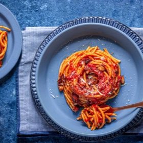

# [Pasta AllAmatriciana](https://www.seriouseats.com/bucatini-pasta-amatriciana-recipe)
> **tags**: #Italian #Pasta #5star

## Description

## Ingredients

- 1 tablespoon (15ml) extra-virgin olive oil
- 6 ounces (170g) guanciale, cut into slices about 1/8 inch thick and then into 3/4- by 1/4-inch strips (see notes)
- Pinch red pepper flakes
- 1/4 cup (60ml) dry white wine
- 1 (28-ounce; 794g) can whole peeled tomatoes, crushed by hand
- Kosher salt and freshly ground black pepper
- 1 pound (450g) dried bucatini pasta (see notes)
- 1 ounce (30g) grated Pecorino Romano cheese, plus more for serving

## Directions
In a large skillet, heat olive oil over medium-high heat until shimmering. Add guanciale and pepper flakes and cook, stirring, until lightly browned, about 5 minutes. Add wine and cook, scraping up any browned bits on bottom of pan, until nearly evaporated, about 3 minutes.

Add tomatoes and bring to a simmer. Season with salt and pepper.

Meanwhile, boil pasta in salted water until just shy of al dente, about 1 minute less than package recommends. Using tongs, transfer pasta to sauce, along with 1/4 cup pasta cooking water. Cook over high heat, stirring and tossing rapidly, until pasta is al dente and sauce has thickened and begins to coat noodles. Remove from heat, add cheese, and stir rapidly to incorporate. Season to taste with more salt and pepper. Serve right away, passing more cheese at the table.

## Notes

## Data
**prep** 20 mins | **cook** 25 mins | **total**  | **serves** 4 servings