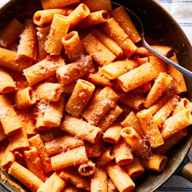

# [Pasta Alla Vodka](https://cooking.nytimes.com/recipes/1019924-pasta-alla-vodka)
> **tags**: #Italian #Pasta #0star

## Description

## Ingredients

- salt
- 1 pound rigatoni or penne pasta
- 2 tablespoons olive oil
- 4 ounces diced pancetta, optional
- 1 onion, finely chopped
- 2 garlic cloves, finely chopped
- 1/2 teaspoon red-pepper flakes
- 3/4 cup vodka
- 1 (28-ounce) can crushed tomatoes
- black pepper
- 3/4 cup heavy cream
- 1/4 cup Parmesan cheese, plus more for serving
- 1 tablespoon oregano, roughly chopped fresh
- 2 tablespoons parsley,  roughly chopped

## Directions
Bring a large pot of salted water to a boil (2 heaping tablespoons kosher salt to about 7 quarts water). Add the pasta and cook according to package instructions until al dente.

Meanwhile, prepare the sauce: Heat the oil in a deep 12-inch skillet or pot over medium. Add the pancetta, if using, and fry until crispy, stirring occasionally, 3 to 5 minutes. Add the onion, garlic and red-pepper flakes and cook, stirring occasionally, until onion is translucent, about 3 minutes. Turn the heat to medium-low, add the vodka and cook until reduced by half, 2 to 3 minutes.

Stir in the tomatoes and then fill the can halfway with water and swish it around to loosen up any leftover tomatoes; add a quarter to half of the water to the pan. Simmer until the sauce begins to thicken, about 10 minutes, and season with salt and pepper. If you prefer your sauce a little looser, go ahead and add the remaining water and simmer 2 to 3 minutes more. Reduce heat to low, add the cream and cook, stirring, until the sauce becomes an even pinkish-rust color, about 1 minute.

Stir in the cooked pasta and 1/4 cup cheese; toss to coat. Season to taste with salt and pepper. Divide among bowls, top with additional cheese, if desired, and sprinkle with the oregano and parsley.

## Notes

## Data
**prep**  | **cook** 30 min | **total** 30 min | **serves** 4 to 6 servings